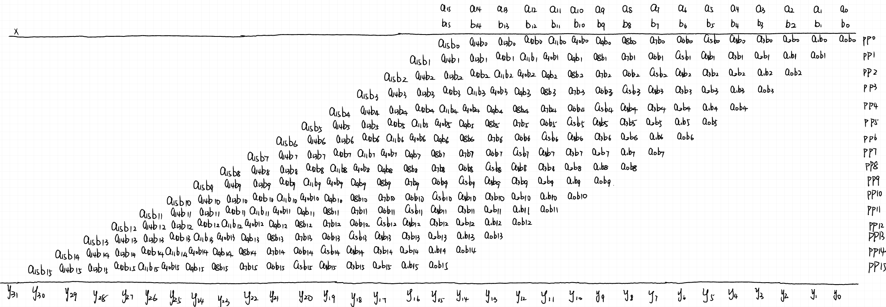

<h1 align = "center">Exercise6 16-bit multipliers</h1>

<center>张旭东 12011923</center>

## 1.Introduction

​	Pipeline is an important technique to increase the performance of a system. The basic idea is to overlap the processing of several tasks so that more tasks can be completed in the same amount of time. Delay and throughput are the two criteria used to examine the performance of a system. Adding pipeline to a combinational circuit can increase the throughput but not reduce the delay. The pipelining technique can be applied to a task that is processed in stages. A combinational circuits can be divided into stages so that the processing of different tasks can be overlapped. To ensure that the signals in each stage flow in the correct order and prevent any potential race, registers must be added between successive stages. The registers ensures that the signals can be passed to the next stage only at predetermined points.

​	The generic construct of VHDL is a mechanism to pass information into an entity and a component. They are first declared in entity and component declaration and later assigned a value during component instantiation. After the declaration, the generic can be used in the associated architecture bodies. A generic can't be modified inside the architecture body and thus functions like a constant.

​	The requirement of exercise $6$ is to simulate and synthesize the two designs of a 16-bit adder-based multipliers, including combinational design and repetitive-addition design and develop an $n$-bit pipeline design of multiplier where $n$ may be an integer from $1$ to $32$. Then compare their delay, throughput, device and utilization.	

## 2.Lab result and analysis

### 2.1Combinational design

​	The procedure of mathematical operation is in `Fig 1`.



 <div align = 'center'><b>Fig.1 procedure of mathematical operation</div>

​	The algorithm includes three tasks: multiply the digits of the multiplier ($b_{15}$, $b_{14}$, $b_{13}$, $b_{12}$, $b_{11}$, $b_{10}$, $b_{9}$, $b_{8}$, $b_{7}$, $b_{6}$, $b_{5}$, $b_{4}$, $b_{3}$, $b_{2}$, $b_{1}$, $b_{0}$) by the multiplicand A=($a_{15}$, $a_{14}$, $a_{13}$, $a_{12}$, $a_{11}$, $a_{10}$, $a_{9}$, $a_{8}$, $a_{7}$, $a_{6}$, $a_{5}$, $a_{4}$, $a_{3}$, $a_{2}$, $a_{1}$, $a_{0}$) one at a time to obtain $b_{15}$*A, $b_{14}$*A, $b_{13}$*A, $b_{12}$*A, $b_{11}$*A, $b_{10}$*A, $b_{9}$*A, $b_{8}$*A, $b_{7}$*A, $b_{6}$*A, $b_{5}$*A, $b_{4}$*A, $b_{3}$*A, $b_{2}$*A, $b_{1}$*A, $b_{0}$*A.
$$
b_{i}*A=(a_{15}*b_{i},a_{14}*b_{i},a_{13}*b_{i},a_{12}*b_{i},a_{11}*b_{i},\\a_{10}*b_{i},a_{9}*b_{i},a_{8}*b_{i},a_{7}*b_{i},a_{6}*b_{i},a_{5}*b_{i},\\a_{4}*b_{i},a_{3}*b_{i},a_{2}*b_{i},a_{1}*b_{i},a_{0}*b_{i})
$$
​	The shift $b_{i}*A$ to left by $i$ position. Finally, add the shifted $b_{i}*A$ terms to obtain the final product. The VHDL code is as below:

```vhdl
library IEEE;
use IEEE.STD_LOGIC_1164.ALL;
use IEEE.STD_LOGIC_ARITH.ALL;
use IEEE.STD_LOGIC_UNSIGNED.ALL;
entity combinational_design is
    Port ( a_in : in STD_LOGIC_VECTOR (15 downto 0);
           b_in : in STD_LOGIC_VECTOR (15 downto 0);
           y : out STD_LOGIC_VECTOR (31 downto 0));
end combinational_design;

architecture Behavioral of combinational_design is
    constant WIDTH:integer:=16;
    signal au,bv0,bv1,bv2,bv3,bv4,bv5,bv6,bv7,bv8,bv9,bv10,bv11,bv12,bv13,bv14,bv15:std_logic_vector (WIDTH-1 downto 0);
    signal pp0,pp1,pp2,pp3,pp4,pp5,pp6,pp7,pp8,pp9,pp10,pp11,pp12,pp13,pp14,pp15,product:std_logic_vector (2*WIDTH-1 downto 0);
    
begin
    au<=a_in;
    
    bv0<=(others =>b_in(0));
    bv1<=(others =>b_in(1));
    bv2<=(others =>b_in(2));
    bv3<=(others =>b_in(3));
    bv4<=(others =>b_in(4));
    bv5<=(others =>b_in(5));
    bv6<=(others =>b_in(6));
    bv7<=(others =>b_in(7));
    bv8<=(others =>b_in(8));
    bv9<=(others =>b_in(9));
    bv10<=(others =>b_in(10));
    bv11<=(others =>b_in(11));
    bv12<=(others =>b_in(12));
    bv13<=(others =>b_in(13));
    bv14<=(others =>b_in(14));
    bv15<=(others =>b_in(15));
    
    pp0<="0000000000000000" & (bv0 and au);
    pp1<="000000000000000" & (bv1 and au) &'0';
    pp2<="00000000000000" & (bv2 and au) &"00";
    pp3<="0000000000000" & (bv3 and au) &"000";
    pp4<="000000000000" & (bv4 and au) &"0000";
    pp5<="00000000000" & (bv5 and au) &"00000";
    pp6<="0000000000" & (bv6 and au) &"000000";
    pp7<="000000000" & (bv7 and au) &"0000000";
    pp8<="00000000" & (bv8 and au) &"00000000";
    pp9<="0000000" & (bv9 and au) &"000000000";
    pp10<="000000" & (bv10 and au) &"0000000000";
    pp11<="00000" & (bv11 and au) &"00000000000";
    pp12<="0000" & (bv12 and au) &"000000000000";
    pp13<="000" & (bv13 and au) &"0000000000000";
    pp14<="00" & (bv14 and au) &"00000000000000";
    pp15<="0" & (bv14 and au) &"000000000000000";
    product<=(pp0+pp1)+(pp2+pp3)+(pp4+pp5)+(pp6+pp7)+(pp8+pp9)+(pp10+pp11)+(pp12+pp13)+(pp14+pp15);
    y<=product;

end Behavioral;

```

​	The code for test bench of combinational design is as below:

```vhdl
library IEEE;
use IEEE.STD_LOGIC_1164.ALL;
entity combinational_design_test is
--  Port ( );
end combinational_design_test;

architecture Behavioral of combinational_design_test is
    component combinational_design is
        Port ( a_in : in STD_LOGIC_VECTOR (15 downto 0);
           b_in : in STD_LOGIC_VECTOR (15 downto 0);
           y : out STD_LOGIC_VECTOR (31 downto 0));
    end component combinational_design;
    
    signal a_tb,b_tb:std_logic_vector (15 downto 0);
    signal y_tb:std_logic_vector (31 downto 0);

begin
    UUT:combinational_design port map(a_in=>a_tb,b_in=>b_tb,y=>y_tb);
    a_tb<="1100111011000101";
    b_tb<="1101010010011101";

end Behavioral;
```

**result and analysis:**


 <div align = 'center'><b>Fig.2 behavioral simulation(upper) , post-synthesis functional simulation(middle) and post-implementation functional(lower)</div>


 <div align = 'center'><b>Fig.3 post-synthesis timing simulation</div>


 <div align = 'center'><b>Fig.4 post-implementation timing simulation</div>


 <div align = 'center'><b>Fig.5 project summary</div>


 <div align = 'center'><b>Fig.6 RTL schematics</div>

​	From the above figures, what can be know is that the code is correct. For post-synthesis timing simulation, the time delay is $8673$ ps. However, the time delay is $15036$ ps for post-implementation simulation, which is almost the twice as that for post-synthesis timing simulation. From the project summary, the utilization of LUT is very low, which is $0.46$%. The total on-chip power, junction temperature and thermal margin are beyond the tolerance of the device.

​	To reduce the cost, it can be found that the bits need to represent `pp0,pp1,pp2,pp3,pp4,pp5,pp6,pp7,pp8,pp9,pp10,pp11,pp12,pp13,pp14,pp15` can be $17$ bits instead of $32$ bits. The code of improved combinational design is as below:

```vhdl
library IEEE;
use IEEE.STD_LOGIC_1164.ALL;
use IEEE.STD_LOGIC_ARITH.ALL;
use IEEE.STD_LOGIC_UNSIGNED.ALL;

entity improved_combinational_design is
    Port ( a_in : in STD_LOGIC_VECTOR (15 downto 0);
           b_in : in STD_LOGIC_VECTOR (15 downto 0);
           y : out STD_LOGIC_VECTOR (31 downto 0));
end improved_combinational_design;

architecture Behavioral of improved_combinational_design is
    constant WIDTH:integer:=16;
    signal au,bv0,bv1,bv2,bv3,bv4,bv5,bv6,bv7,bv8,bv9,bv10,bv11,bv12,bv13,bv14,bv15:std_logic_vector (WIDTH-1 downto 0);
    signal pp0,pp1,pp2,pp3,pp4,pp5,pp6,pp7,pp8,pp9,pp10,pp11,pp12,pp13,pp14,pp15:std_logic_vector (WIDTH downto 0);
    signal product:std_logic_vector (2*WIDTH-1 downto 0);
       
begin
    au<=a_in;
    
    bv0<=(others =>b_in(0));
    bv1<=(others =>b_in(1));
    bv2<=(others =>b_in(2));
    bv3<=(others =>b_in(3));
    bv4<=(others =>b_in(4));
    bv5<=(others =>b_in(5));
    bv6<=(others =>b_in(6));
    bv7<=(others =>b_in(7));
    bv8<=(others =>b_in(8));
    bv9<=(others =>b_in(9));
    bv10<=(others =>b_in(10));
    bv11<=(others =>b_in(11));
    bv12<=(others =>b_in(12));
    bv13<=(others =>b_in(13));
    bv14<=(others =>b_in(14));
    bv15<=(others =>b_in(15));
    
    pp0<='0' & (bv0 and au);
    pp1<=('0' & pp0(WIDTH downto 1))+('0' & (bv1 and au));
    pp2<=('0' & pp1(WIDTH downto 1))+('0' & (bv2 and au));
    pp3<=('0' & pp2(WIDTH downto 1))+('0' & (bv3 and au));
    pp4<=('0' & pp3(WIDTH downto 1))+('0' & (bv4 and au));
    pp5<=('0' & pp4(WIDTH downto 1))+('0' & (bv5 and au));
    pp6<=('0' & pp5(WIDTH downto 1))+('0' & (bv6 and au));
    pp7<=('0' & pp6(WIDTH downto 1))+('0' & (bv7 and au));
    pp8<=('0' & pp7(WIDTH downto 1))+('0' & (bv8 and au));
    pp9<=('0' & pp8(WIDTH downto 1))+('0' & (bv9 and au));
    pp10<=('0' & pp9(WIDTH downto 1))+('0' & (bv10 and au));
    pp11<=('0' & pp10(WIDTH downto 1))+('0' & (bv11 and au));
    pp12<=('0' & pp11(WIDTH downto 1))+('0' & (bv12 and au));
    pp13<=('0' & pp12(WIDTH downto 1))+('0' & (bv13 and au));
    pp14<=('0' & pp13(WIDTH downto 1))+('0' & (bv14 and au));
    pp15<=('0' & pp14(WIDTH downto 1))+('0' & (bv15 and au));
    
    product<=pp15 & pp14(0)& pp13(0)& pp12(0)& pp11(0)& pp10(0)& pp9(0)& pp8(0)& pp7(0)& pp6(0)& pp5(0)& pp4(0)& pp3(0)& pp2(0)& pp1(0)& pp0(0);

    y<=product;
end Behavioral;
```

  The results of improved combinational design are as below:


 <div align = 'center'><b>Fig.7 behavioral simulation(upper) , post-synthesis functional simulation(middle) and post-implementation functional(lower)</div>


 <div align = 'center'><b>Fig.8 post-synthesis timing simulation</div>


 <div align = 'center'><b>Fig.9 post-implementation timing simulation</div>


 <div align = 'center'><b>Fig.10 project summary</div>


 <div align = 'center'><b>Fig.11 RTL schematics</div>

​	Compared to the performance and cost of original combinational design, the time delay for post-synthesis timing simulation of improved combinational design is much longer, which is $22981$ ps. And the time delay for post-implementation timing simulation of improved combinational design is $33239$ ps, which is longer than $15036$ ps for original combinational design. For device utilization, although the utilization of LUT, $0.38$%, is lower, the utilization of IO resource is higher, which is $30.48$%. Although the total on-chip power is higher than that of original combinational design, the thermal margin is lower. From the RTL schematics, the wiring and layout of improved combinational design is not as dense as before.

### 2.2 Repetitive-addition design

​	Another way to realize $16$-bit multipliers is based on repetitive-addition design, which uses FSMD. FSMD is covered in detail in the previous report.

​	**Pseudo code:**

```vhdl
if(a_in=0 or b_in=0)then{
	r=0;}
else{
	a=a_in;
	n=b_in;
	r=0;
op: r=r+a;
	n=n-1;
	if(n=0) then{goto stop}
	else{goto op}
	}
stop:r_out=r;
```

​	step1: Defining the input and output signals

- Input signals: 

  – a_in and b_in: input operands. 16-bit signals with `std_logic_vector` data type and interpreted as unsigned integers 

  – start: command. The multiplier starts operation when the start  signal is activated. 

  – clk: system clock; 

  – reset: asynchronous reset signal for system initialization.	

- Output signals:

​					– r_out: the product. 32-bit signals. 

​					– ready: external status signal. It is asserted when the  multiplication circuit is idle and ready to accept new 									inputs.

​	step2: Converting the algorithm to an ASM chart


 <div align = 'center'><b>Fig.12 ASM chart</div>

step 3: Constructing the FSMD

​	RT operation and conceptual diagram of the circuit associated with  the $r,n,a $ registers:

<center class="half">    
        
     
</center

<center class="half">    
        
     
</center
 <div align = 'center'><b>Fig.13 RT operation and conceptual diagram of the circuit associated with registers</div>

​	Complete block diagram of a repetitive-addition multiplier:


 <div align = 'center'><b>Fig.14 completed block diagram</div>

Step 4: VHDL descriptions of FSMD

```vhdl
library IEEE;
use IEEE.STD_LOGIC_1164.ALL;
use IEEE.STD_LOGIC_ARITH.ALL;
use IEEE.STD_LOGIC_UNSIGNED.ALL;

entity repetive_addition is
  Port (CLK,RESET,start: in std_logic;
         a_in,b_in:in std_logic_vector (15 downto 0);
         ready: out std_logic ;
         r: out std_logic_vector (31 downto 0)  );
end repetive_addition;

architecture Behavioral of repetive_addition is
    constant WIDTH:integer :=16;
    type state_type is (idle,ab0,load,op);
    signal state_next,state_reg:state_type;
    signal a_reg,a_next,n_reg,n_next:std_logic_vector (WIDTH-1 downto 0);
    signal r_reg,r_next:std_logic_vector (2*WIDTH-1 downto 0);
begin

    --state and data registers
    clock:process(CLK,RESET) is
    begin
    if RESET='1' then
        state_reg<=idle;
        a_reg<=(others =>'0');
        n_reg<=(others =>'0');
        r_reg<=(others =>'0');
    elsif CLK'event and CLK='1' then
        state_reg<=state_next;
        a_reg<=a_next;
        n_reg<=n_next;
        r_reg<=r_next;
    end if;
    end process clock;
    
    --combinational circuit
    process(start,state_reg,a_reg,n_reg,r_reg,a_in,b_in) is
    begin
        --default value
        a_next<=a_reg;
        n_next<=n_reg;
        r_next<=r_reg;
        ready<='0';
        
        case state_reg is
            when idle =>
                if start='1' then
                    if(a_in="0000000000000000" or b_in="0000000000000000") then
                        state_next<=ab0;
                    else
                        state_next<=load;
                    end if;
                else
                    state_next<=idle;
                end if;
                ready<='1';
            when ab0=>
                r_next<=(others =>'0');
                a_next<=a_in;
                n_next<=b_in;
                state_next<=idle;
            when load=>
                a_next<=a_in;
                n_next<=b_in;
                r_next<=(others =>'0');
                state_next<=op;
            when op=>
                r_next<=r_reg+("0000000000000000" & a_reg);
                n_next<=n_reg-1;
                if(n_reg="0000000000000001")then
                    state_next<=idle;
                 else
                    state_next<=op;
                 end if;

        end case;
    end process;
    r<=r_reg;    
end Behavioral;

```

​	The code of test bench is as below:

```vhdl
library IEEE;
use IEEE.STD_LOGIC_1164.ALL;
entity test_repetitive is
--  Port ( );
end test_repetitive;

architecture Behavioral of test_repetitive is
    component repetive_addition is
        Port ( CLK,RESET,start: in std_logic;
         a_in,b_in:in std_logic_vector (15 downto 0);
         ready: out std_logic ;
         r: out std_logic_vector (31 downto 0));
    end component repetive_addition;
    
    signal clk_tb,reset_tb,start_tb,ready_tb:std_logic ;
    signal a_tb,b_tb:std_logic_vector (15 downto 0);
    signal r_tb:std_logic_vector (31 downto 0);
begin
    UUT:repetive_addition port map(CLK=>clk_tb,RESET=>reset_tb,start=>start_tb,ready=>ready_tb,a_in=>a_tb,b_in=>b_tb,r=>r_tb);
    clock_gen:process
    constant period:time:=10ns;
    begin
        clk_tb<='0';
        wait for period/2;
        clk_tb<='1';
        wait for period/2;
    end process clock_gen;
    
    reset_tb<='1','0'after 10 ns;
    start_tb<='0','1' after 50 ns,'0' after 160 ns;
    
    a_tb<="1100111011000101";
    b_tb<="1101010010011101";

end Behavioral;

```

​	**result and analysis:**


<div align = 'center'><b>Fig.15 behavioral simulation(upper) , post-synthesis functional simulation(middle) and post-implementation functional(lower)</div>


 <div align = 'center'><b>Fig.16 post-synthesis timing simulation</div>


<div align = 'center'><b>Fig.17 post-implementation timing simulation</div>


<div align = 'center'><b>Fig.18 project summary</div>


<div align = 'center'><b>Fig.19 RTL schematic</div>

​	The result is `abb9f2d1`, which proves the code of repetitive addition is correct. The result of behavioral simulation, post-synthesis functional simulation and post-implementation functional simulation indicates the time used to calculate the final result is $544355$ns in an ideal situation, which is much longer than that of combinational design. For post-synthesis timing simulation, the duration for unknown is $1.340$ns and the total time used to calculate the final result is $544408.793$ns. For post-implementation timing simulation, the duration for unknown is $2.637$ns and the total time used to calculate the final result is $544412.348$ns. The time for post-implementation timing simulation is a little longer than that for post-synthesis timing simulation, which is in line with our expectation. In terms of time delay, the performance of combinational design is much better than that of repetitive addition design because the method of repetitive addition design uses registers.

​	For device utilization, the utilization of LUT is $0.12$%, which is lower than that of combinational design. However, the utilization of IO resource is $32.38$%, which is higher than that of combinational design. More importantly, the cost on power of repetitive addition design is much less than that of combinational design. The total on-chip power is $5.984$W, the junction temperature is $52.3$℃ and the thermal margin is $32.7$℃. All of these are within the tolerance range of the device, which will not destroy the device. 

### 2.3 Pipeline Design

​	To convert a combinational circuit to a pipelined design, derive the block diagram of the original combinational circuit and arrange it as a cascading chain, identify the major components and estimate the relative propagation delays of these components, divide the chain into stages of similar propagation delays. After these, identify the signals that cross the boundary of the chain and insert registers for these signals in the boundary.


<div align = 'center'><b>Fig.20 the pipelined design of 16-bit multiplier</div>

​	To develop an $n$-bit pipeline design of multiplier where $n$ may be an integer from $1$ to $32$, it is easy to find that the number of stages is related to $n$ and each of stage is similar. So an entity named `stage` is defined.


<div align = 'center'><b>Fig.21 the conceptual diagram of 16-bit multiplier</div>

​	The VHDL code of `stage` is as below:

```vhdl
library IEEE;
use IEEE.STD_LOGIC_1164.ALL;
use IEEE.STD_LOGIC_ARITH.ALL;
use IEEE.STD_LOGIC_UNSIGNED.ALL;

entity stage is
        generic(WIDTH:natural;
                STAGE:natural);
        Port (CLK_in,RST_in: in std_logic ;
        pp_in: in std_logic_vector (2*WIDTH-1 downto 0);
        a_in : in std_logic_vector(WIDTH-1 downto 0);
        b_in : in std_logic_vector(WIDTH-1 downto 0);
        pp_out : out std_logic_vector(2*WIDTH-1 downto 0);
        a_out : out std_logic_vector(WIDTH-1 downto 0);
        b_out : out std_logic_vector(WIDTH-1 downto 0) );
end stage;

architecture Behavioral of stage is
    signal bv:std_logic_vector(WIDTH-1 downto 0);
    signal bp:std_logic_vector(2*WIDTH-1 downto 0);
    signal left_fill :std_logic_vector(WIDTH-STAGE-1 downto 0);
    signal right_fill:std_logic_vector(STAGE-1 downto 0);
    signal pp_reg,pp_next:std_logic_vector(2*WIDTH-1 downto 0);
    signal a_reg,a_next,b_reg,b_next:std_logic_vector(WIDTH-1 downto 0);
begin
     process(CLK_in,RST_in) is
    begin
        if(RST_in='1') then
            pp_reg<=(others=>'0');
            a_reg<=(others=>'0');
            b_reg<=(others=>'0');
        elsif (CLK_in'event and CLK_in ='1') then
            pp_reg<=pp_next;
            a_reg<=a_next;
            b_reg<=b_next;
        end if;
    end process;
    
    bv<=(others=>b_in(STAGE));
    left_fill<=(others=>'0');
    right_fill<=(others=>'0');
    bp<=left_fill & (bv and a_in) & right_fill;
    pp_next<=pp_in+bp;
    a_next<=a_in;
    b_next<=b_in;
    pp_out<=pp_reg;
    a_out<=a_reg;
    b_out<=b_reg;
end Behavioral;
```

​	The signal `left_fill` and `right_fill` represent the number of zeros to the left and right of `bp`. Then the number of stages is generated using for generate statement based on $n$. An entity named `mul` represents this. The code is as below:

```vhdl
library IEEE;
use IEEE.STD_LOGIC_1164.ALL;
use IEEE.STD_LOGIC_ARITH.ALL;
use IEEE.STD_LOGIC_UNSIGNED.ALL;
entity mul is
    generic(W:natural);
    Port(CLK : in STD_LOGIC;
           RST : in STD_LOGIC;
           a : in std_logic_vector(W-1 downto 0);
           b : in std_logic_vector(W-1 downto 0);
           y : out std_logic_vector(2*W-1 downto 0) );
end mul;
architecture Behavioral of mul is
    component stage is
        generic(WIDTH:natural;
                STAGE:natural);
        Port (CLK_in,RST_in: in std_logic ;
        pp_in: in std_logic_vector (2*WIDTH-1 downto 0);
        a_in : in std_logic_vector(WIDTH-1 downto 0);
        b_in : in std_logic_vector(WIDTH-1 downto 0);
        pp_out : out std_logic_vector(2*WIDTH-1 downto 0);
        a_out : out std_logic_vector(WIDTH-1 downto 0);
        b_out : out std_logic_vector(WIDTH-1 downto 0) );
    end component stage;
    
    signal left :std_logic_vector(W-1 downto 0);
    signal bv0,bvn: std_logic_vector(W-1 downto 0);
    signal bp0,bpn: std_logic_vector(2*W-1 downto 0);
    signal pp0,ppn: std_logic_vector(2*W-1 downto 0);
    signal pp_temp:std_logic_vector(W*2*W-1 downto 0);
    signal a_temp,b_temp:std_logic_vector(W*W-1 downto 0);

begin
    left<=(others=>'0');
    bv0<=(others=>b(0));
    bp0<=left &(bv0 and a);
    pp0<=bp0;
    a_temp(W-1 downto 0)<=a;
    b_temp(W-1 downto 0)<=b;
    pp_temp(2*W-1 downto 0)<=pp0;
    
    stage_loop: for i in 1 to W-1 generate
        stage_inst:stage
            generic map(WIDTH=>W,STAGE=>i)
            port map(CLK_in => CLK,
                     RST_in => RST,
                     pp_in => pp_temp(i*2*W-1 downto (i-1)*2*W),
                     a_in => a_temp(i*W-1 downto (i-1)*W),
                     b_in => b_temp(i*W-1 downto (i-1)*W),
                     pp_out=>pp_temp((i+1)*2*W-1 downto (i)*2*W),
                     a_out=>a_temp((i+1)*W-1 downto (i)*W),
                     b_out=>b_temp((i+1)*W-1 downto (i)*W)   );
    end generate; 
    y<=pp_temp(pp_temp'length-1 downto pp_temp'length-2*W);
end Behavioral;

```

​	The signal `pp0` represent the first stage. Three more signals, `a_temp`, `b_temp` and `pp_temp` record the output signals of each stage and the input signals of the next stage. To use the parameterized free-running binary counter in  a hierarchical design, a similar component declaration  should be included in the architecture declaration. The generic can then be assigned a value in the generic  mapping section when a component instance is  instantiated. The code of instantiation is as below:

```vhdl
library IEEE;
use IEEE.STD_LOGIC_1164.ALL;
entity top_module is
      Port (CLK_t : in STD_LOGIC;
           RST_t : in STD_LOGIC;
           a_t : in std_logic_vector(15 downto 0);
           b_t : in std_logic_vector(15 downto 0);
           y_t : out std_logic_vector(31 downto 0) );
end top_module;
architecture Behavioral of top_module is
    component mul is
        generic (W:natural);
        Port ( CLK : in STD_LOGIC;
                RST : in STD_LOGIC;
                a : in std_logic_vector(W-1 downto 0);
                b : in std_logic_vector(W-1 downto 0);
                y : out std_logic_vector(2*W-1 downto 0));
    end component mul;
begin
    inst:mul generic map(W=>16) port map(CLK=>CLK_t,RST=>RST_t,a=>a_t,b=>b_t,y=>y_t);

end Behavioral;
```

 The code of test bench is as below:

```vhdl
library IEEE;
use IEEE.STD_LOGIC_1164.ALL;
entity test_pipeline is
--  Port ( );
end test_pipeline;

architecture Behavioral of test_pipeline is
    component top_module is
        Port ( CLK_t : in STD_LOGIC;
           RST_t : in STD_LOGIC;
           a_t : in std_logic_vector(15 downto 0);
           b_t : in std_logic_vector(15 downto 0);
           y_t : out std_logic_vector(31 downto 0));
    end component top_module;
    
    signal clk_tb,reset_tb:std_logic ;
    signal a_tb,b_tb:std_logic_vector (15 downto 0);
    signal y_tb:std_logic_vector (31 downto 0);

begin
    UUT:top_module port map(CLK_t=>clk_tb,RST_t=>reset_tb,a_t=>a_tb,b_t=>b_tb,y_t=>y_tb);
    clock_gen:process
    constant period:time:=10ns;
    begin
        clk_tb<='0';
        wait for period/2;
        clk_tb<='1';
        wait for period/2;
    end process clock_gen;
    
    reset_tb<='1','0'after 10 ns;
    
    a_tb<="1100111011000101";
    b_tb<="1101010010011101";

end Behavioral;

```

​	**result and analysis:**


<div align = 'center'><b>Fig.22 behavioral simulation(upper) , post-synthesis functional simulation(middle) and post-implementation functional(lower)</div>


 <div align = 'center'><b>Fig.23 post-synthesis timing simulation</div>


<div align = 'center'><b>Fig.24 post-implementation timing simulation</div>


<div align = 'center'><b>Fig.25 project summary</div>


<div align = 'center'><b>Fig.26 RTL schematic</div>

​	The result is `abb9f2d1`, which proves the code of pipeline design is correct. The result of behavioral simulation, post-synthesis functional simulation and post-implementation functional simulation indicates the time used to calculate the final result is about $155$ns in an ideal situation, which is much longer than that of combinational design and much shorter than that of repetitive addition. For post-synthesis timing simulation, the duration for unknown is $1.340$ns and the total time used to calculate the final result is $248.793$ns. For post-implementation timing simulation, the duration for unknown is $2.386$ns and the total time used to calculate the final result is $252.353$ns. The time for post-implementation timing simulation is a little longer than that for post-synthesis timing simulation, which is in line with our expectation. In terms of time delay, the performance of pipeline design is much better than that of repetitive addition design and worse than combinational design. The reason why the performance of pipeline design is much better than that of repetitive addition design in terms of time delay is that the former completes sixteen multiplications and sixteen additions in one period while the latter completes one additions in one period.

​	For device utilization, the utilizations of LUT and flip-flop are $0.44$% and $0.43$% , which is higher than those of repetitive addition design. However, the utilization of IO resource is $31.43$%, which is lower than that of repetitive addition design. What's more, the pipeline design uses LUTRAM resource. What's more, the cost on power of pipeline design is much higher than that of repetitive addition design. The total on-chip power is $34.958$W, the junction temperature is $125$℃ and the thermal margin is $-99.5$℃. All of these are beyond the tolerance range of the device, which will destroy the device.

​	In terms of throughput, a new load cannot start until the previous load is completed for combinational design and repetitive addition design. So, for combinational design, the delay of processing one load is $15.036$us and the throughput is $\frac{1}{15.036}*10^{9}$ load per second. For repetitive addition design, the delay of processing one load is $544412.348$ns and the throughput is $\frac{1}{544412.348}*10^{9}$ load per second. For pipeline design, there are $15$ stages. Ideally, assume the propagation delay of each stage is identical. The delay in processing one load is $252.353$ns. To process $k$ loads, the delay will be $252.353+\frac{252.353}{15}k$ ns. The throughput becomes $\frac{k}{252.353+\frac{252.353}{15}k}$ ns. When $k$ is large, the throughput is $\frac{15}{252.353}$ ns. 


<div align = 'center'><b>Fig.27 stages of pepiline design</div>

## 3.Conclusion

​	According to the analysis above, combinational design is applied to scenarios requiring low time delay and short calculated bits. As for repetitive addition, it is applied to scenarios with low time delay requirements and low power consumption. And for pipeline design, the candidate circuits for effective pipeline design should include the following characteristics, including enough input data to feed the pipeline circuit, the throughput is the main performance criterion, the combinational circuit can be divided into stages with similar propagation delay and the propagation delay of a stage is much longer than the delay incurred due to the register.

​	There is one important point need to consider for parameterized design. To use the parameterized free-running binary counter in  a hierarchical design, a similar component declaration  should be included in the architecture declaration. The generic can then be assigned a value in the generic  mapping section when a component instance is  instantiated.