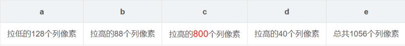
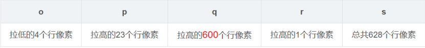
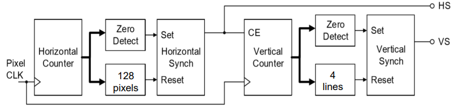

<h1 align = "center">Image edge information extraction system based on FPGA</h1>

陈思佑 12010102        张旭东 12011923

## 1. Project objective

​	Edge detection is an important technology in digital image processing, which can extract the contour information of objects and support the application of image recognition, segmentation and target tracking. FPGA technology is widely used in the field of digital signal processing, which can realize high-speed parallel processing. The combination of FPGA, camera and VGA can realize the collection, processing and output of image information. Using the high performance calculation and programmability of FPGA, the edge information is extracted and output to the display screen, so as to realize efficient digital image processing.

## 2. System framework design

<b>Fig.1 Block diagram of our system

1. **Image acquisition module**: The camera module is used to collect external video signals and convert them into digital signals and input them into FPGA.
2. **Image processing and edge detection module**: image preprocessing using FPGA, including noise removal and image enhancement. Then the edge detection operation is carried out to extract the image edge information.
3. **VGA output module**: output the processed image signals to the VGA display screen and display them through the display screen.

## 3. OV7076 connection

​	Identify the GPIO (General Purpose input/Output) pins available on the FPGA board that will be used to communicate with the OV7076 module, connect these pins to the corresponding position of the FPGA. The OV7670 requires specific timing and control signals to operate correctly. These include the pixel clock (PCLK), horizontal synchronization (HSYNC), and vertical synchronization (VSYNC) signals. These signals will need to be generated by the FPGA and connected to the appropriate pins on the camera module. 

​	Once the OV7670 is connected and the timing and control signals are generated, you can start capturing images. To do this, you will need to configure the camera module to output data in the desired format and then read the data from the data pins. The data can then be stored in memory or processed in real-time.

## 4.  Achieve display of VGA

​	VGA(Video Graphics Array) is a kind of video transmission standard based on analog signal introduced by IBM in $1987$ along with `PS/2`. It has the advantages of high resolution, fast display rate and rich color, which has been widely used in the field of color display. The principle of display of VGA involves many technical fields, including graphics processing, electronic circuits, digital signal processing, and so on.

​	The pin diagram of VGA is in `Fig1`.

<b>Fig.2 the pin diagram of VGA

### 4.1 Principle of color

​	Because the eyes of human have pyramidal cells that sense red, green, and blue, color space can usually be represented by three basic colors. The three primary colors are independent of each other, and no one primary color can be combined with the other two colors. Red, green and blue are the three primary colors, which are the most widely used. VGA displays usually work at the depth of 8 bits(256 colors). The depth of color represents the number of colors that can be displayed per pixel. 8-bit color depth means that each pixel can display 256 different colors. The higher the color depth, the more detailed the image appears on the screen. 

### 4.2 implementation of display

​	The input signal of `Pin1`, `Pin2` and `Pin3` is analog voltage of $0-0.714V$, instead of digital signal of $0$ and $1$. Black is displayed when the input signal is $0V$ and the strongest color is displayed when the input signal is $0.714V$. When the analog voltages of `Pin1`, `Pin2` and `Pin3` are different, the different colors are displayed. However, the FPGA generate digital signal only. So the digital signal need to be converted to analog signal. The most common method of converting digital signal to analog signal is using a weight resistance network. The weight resistance network is in `Fig2`.

  
<b>Fig.3 the weight resistance network

### 4.3 Communication protocol of VGA

​	The communication timing of VGA is `Fig3`.

 
<b>Fig.4 communication timing of VGA

​	There are four parts in frame timing and line timing, including synchronization pulse, back porch, display interval and front porch. They are represented by $o$, $p$, $q$ and $r$ in frame timing and $a$, $b$, $c$ and $d$ in line timing. At these stages of synchronization pulse, back porch and front porch, the signals of red, blue and green are invalid. Only the signals of red, blue and green are valid at the stage of display interval.

### 4.4 Spatial resolution and refresh frequency

​	Spatial resolution represents the number of pixels that can be displayed on the display. The larger spatial resolution is, the more detailed the image is on the screen. Besides, resolution also affects the size of the image on the screen. VGA display usually work at $640×480$ resolution.

​	Refresh frequency represents the frames displayed per second. In general, the higher refresh frequency is, the smoother the video will look.

​	Take $800×600@60Hz$ for example.

 
<b>Fig.5 parameters of 800×600@60Hz

​	$800$ means that each row has $800$ pixels to display at the stage of display interval for HSYNC. The value of $e$ means the clock cycle required to display a row of pixels. $600$ means the number of rows to display at the stage of display interval for VSYNC. The value of $s$ means the clock cycle required to display a frame. $60Hz$ means the number of frames to display per second. So, the required clock cycle per second is $1056×628×60$,which is the frequency of the clock.

​	The driver module of VGA is in `Fig5`.

 
<b>Fig.6 drive module of VGA

- RST: global reset signal
- CLK_25MHz: input, 25MHz clock
- HS: output, to monitor, horizontal synchronization signal
- VS: output, to monitor, vertical synchronization signal
- BLANK: output, to client, blank signal, active when pixel is not in visible area, which is $1$ at the stages of synchronization pulse, back porch and front porch and $0$ otherwise.
- HCOUNT: output, $11$ bits, to client, horizontal pixel counter
- VCOUNT: output, $11$ bits, to client, vertical lines counter

​	The conceptual of  displaying bar is in `Fig6`.

 
<b>Fig.7 conceptual of displaying bar

​	The conceptual of  displaying a still image is in `Fig7`.

 
<b>Fig.8 conceptual of displaying a still image

## 5. Image edge extraction

4.1 Median filtering

Median filtering is a commonly used method for removing noise from images or signals. It works by replacing the value of each pixel or sample with the median value of its neighboring pixels or samples. **For images captured by OV7670 camera, we will carry out median filtering to remove the salt and pepper noise.**

4.2 sobel operator

The Sobel operator is a widely used image processing technique for edge detection. It works by convolving an image with a small kernel (typically a 3x3 or 5x5 matrix) that emphasizes the edges of the image. Specifically, the Sobel operator computes the gradient of the image intensity at each pixel, which represents the rate of change of the intensity in the x and y directions. The magnitude of the gradient is then used to determine the strength of the edge. **In this project, we will use sobel operator to filter the image, get the image edge information and output the edge information to VGA display.**

## 6. The pmod device/external device used

1. OV7670 camera
2. VGA display