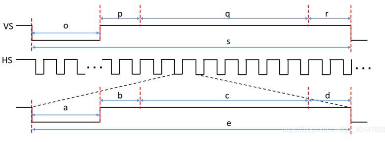

# Image edge information extraction system based on FPGA

<center>陈思佑 12010102 &nbsp&nbsp&nbsp&nbsp&nbsp&nbsp&nbsp&nbsp&nbsp 张旭东 12011923 </center>

## I. Introduction

​	Edge detection is an important technology in digital image processing, which can extract the contour information of objects and support the application of image recognition, segmentation and target tracking. Among them, the extraction of image edge information is a key task, which can help us understand the structure and shape of the image, and provide the basis for the subsequent analysis and processing.  FPGA technology is widely used in the field of digital signal processing, which can realize high-speed parallel processing. 

​	Image edge information extraction project based on FPGA (Field Programmable Gate Array) aims to take advantage of hardware acceleration to realize efficient image edge detection algorithm. The system will use an advanced edge detection algorithm, such as Sobel algorithm, to extract the edge information in the image with high precision and high efficiency. By implementing the algorithm on FPGA, the parallel computing capability of FPGA can be fully utilized, and the processing speed and real-time performance can be improved.

​	This project achieves the functions of real-time video capture by camera name`OV5640`, Sobel operator used to extract the captured video edge and result displayed by VGA.

## II. `Pmod` Device

### A. OV5640


<div align = 'center'><b>Fig.1 OV5640 camera</div>

​	The OV5640 is an image sensor chip developed by OmniVision Technologies. It is a high-performance camera solution for embedded systems and mobile devices. It features a quarter-inch CMOS image sensor with a 5-megapixel resolution. It supports color image capture and video recording, and has a wealth of features and configuration options that make it suitable for a variety of application scenarios. The camera has many features and advantages. First, the OV5640 uses advanced image sensor technology to achieve high quality image capture and video recording, presenting clear, delicate image detail and color saturation. In addition, the OV5640 supports a variety of image processing features, such as automatic exposure control, automatic white balance, image noise reduction and color enhancement. These features enable image quality to be further optimized and enhanced, enabling users to adjust image parameters according to specific requirements. The OV5640 also features low power consumption and high performance, making it suitable for mobile devices and embedded systems. It uses advanced image sensors and signal processing technology to deliver excellent image performance in low-light conditions while minimizing power consumption and extending the battery life of the device.


<div align = 'center'><b>Fig.2 Block diagram of OV5640</div>

#### OV5640 Pin

1. VDD (power supply pin) : The power supply pin is used to supply the power voltage required by the camera module. It is usually 3.3V

2. GND (grounding pin) : The grounding pin is connected to the power grounding and provides the reference ground for the circuit.

3. SIOC(Serial Bus Clock) : The Serial Camera Control Bus (SCCB) or Serial Interface Output Clock (SIOC) pins are used to transmit the serial clock signal of camera configuration and control data.

4. SIOD(Serial Bus Data) : SCCB (Serial Camera Control Bus) or SIOD(Serial Interface Output Data) pins are used to transmit serial data signals of camera configuration and control data.

5. RESET: Reset the pin, which is used to reset the camera module and restore it to default state.

6. PWDN (Power off pin) : The power off pin controls the power status of the camera. By lowering the pin, the camera can enter the state of low power consumption or off.

7. XCLK (Pixel clock) : Pixel clock pin, clock signal provided to the camera, used to synchronize the output of the image sensor.

8. VSYNC (Field synchronization pin) : The field synchronization pin indicates the beginning and end of the image frame, and the vertical synchronization of the field.

9. HREF (Line synchronization pin) : Line synchronization pins indicate the start and end of the image line, and horizontal synchronization of the line.

10. PCLK (Pixel clock pin) : Pixel clock pin, used to transmit the clock signal of pixel data.

11. D[7:0] (Data pin) : Data pin, a parallel data signal used to transmit pixel data, usually an 8-bit data bus.

    

    

    <div align = 'center'><b>Fig.3 OV5640 circuit</div>

#### OV5640 Power on


<div align = 'center'><b>Fig.4 Power on sequence</div>

​	The data manual of Ov5640 clearly explains the timing sequence of camera power-on. The timing delay of ACDD and DVDD is automatically met by the hardware, so we only need to configure the PWDN output and RESET signal. After a delay of 6MS after DVDD pulling up, PWDN can be set to 0 directly without delay due to the enable of high level power-off of ov5640_pwdn signal. After 2MS, the RESET signal is pulled up, and after 21MS, the camera register can be configured through SCCB protocol.

#### SCCB protocol


<div align = 'center'><b>Fig.5 SCCB sequence</div>

​	The OV5640 uses the Serial Camera Control Bus (SCCB) protocol to communicate with external controllers such as microprocessors or FPGas. SCCB is a serial communication protocol similar to the I2C (Inter-Integrated Circuit) bus protocol used to configure and control the internal registers of the OV5640. SCCB is a bus developed by Omni Image Technology Co., LTD. (OmniVision), and widely used in OV series image sensors, so generally using OV image sensors are inseparable from SCCB bus protocol. Generally speaking, there are two working modes of SCCB: one master and multiple slave, and one master and one slave. SCCB is very similar to IIC. The following is an introduction to this pin.

| SIO_C | SCL  | host active | When the bus is idle, the host driver this pin is 1; SIO_D can only change if SIO_C is 0, |
| ----- | ---- | -------- | ------------------------------------------------------------ |
| SIO_D | SDA  | two-way transmission | When the bus is idle, it maintains a high resistance state. After transmission begins, SIO_D starts to transmit data, which is maintained at high voltage and changed at low voltage |

**Initial signal**: When SIO_C is at high level and SIO_D appears a falling edge, SCCB begins transmission.
**Stop signal**: When SIO_C is at high level and SIO_D appears a rising edge, SCCB stops transmission.
**Valid data**: SIO_D is valid at SIO_C high voltage.

​	In the transmission format, SCCB uses the three-phase transmission format. Since SCCB is mainly used to configure registers, it mainly performs write operations. The following is the data format for write operations,


<div align = 'center'><b>Fig.6 Transmission data format (write)</div>

**Phase1**: The address byte contains the device address and read/write bits. On the I2C bus, each slave device has a unique address, and the master device communicates with the slave device by sending address bytes. The address byte consists of 7 bits, an 8-bit byte, with the first 7 bits used for the device address and the lowest bit used to indicate a read (1) or write (0) operation.

**Phase2**: Manipulate the register address, which is 16 bits in OV5640.

**Phase3**: The data written to the register is 8 bits in the OV5640, and the device receiving the data samples each bit in transit and writes it to the register.

​	Through this protocol, we can configure the register of the camera, among which the most critical is to control the camera output image size, output image format and image clock register, this part will be expanded in the following code.


<div align = 'center'><b>Fig.7 registers that configures the image size</div>


<div align = 'center'><b>Fig.8 Output sequence</div>

​	According to the output timing of the OV5640, image data can be transferred from the sensor to an external processor or display device with the correct clock and synchronization signal. By analyzing the output timing signal, pixel data of each row and column can be obtained to construct a complete image.

**PCLK（Pixel Clock）**：PCLK is the pixel clock signal, which defines the sampling time of image data output by the image sensor. The frequency of PCLK determines the transmission speed of image data.

**HSYNC（Horizontal Sync）**：HSYNC is the horizontal synchronization signal used to define the starting position of each line of the image output by the image sensor. When the HSYNC signal jumps from low level to high level, it indicates the beginning of a line.

**VSYNC（Vertical Sync）**：VSYNC is the vertical synchronization signal used to define the starting position of each frame of the image output by the image sensor. When the VSYNC signal jumps from low level to high level, it indicates the beginning of a frame.

**D[7:0]（Data）**：D[7:0] is the image data line output by the image sensor, where D[7] is the most significant bit and D[0] is the least significant bit. These data lines transmit the pixel values of the image, which are used to form the final image.

### B. VGA displayer


<div align = 'center'><b>Fig.9 display</div>

​	The VGA display used in this project is an ordinary display.

#### Principle of VGA display


<div align = 'center'><b>Fig.10 VGA interface</div>

​	The VGA interface has total 15 pins. However, `Pin1`, `Pin2` ,`Pin3`, `Pin13` and `Pin14` are the target pins because `Pin1` inputs red primary color signals, `Pin2` inputs green primary color signals, `Pin3` inputs blue primary color signals, `Pin13` inputs line synchronization signals and `Pin14` inputs field synchronization signals. Each pixel on VGA display can have a variety of colors, consisting of three primary color signals, including red, green and blue.


<div align = 'center'><b>Fig.11 input signals of VGA interface</div>

​	The input signals of `Pin1`, `Pin2` and `Pin3` are $0$V-$0.174$V analog voltage instead of digital voltage. When the voltage of `Pin1`, `Pin2` and `Pin3` are different, different colors are displayed. However, FPGA can only generate digital signals. So resistance network is used for DA conversion.


<div align = 'center'><b>Fig.12 resistance network</div>

#### VGA communication protocol



<div align = 'center'><b>Fig.13 frame timing and line timing</div>

​	Frame timing and line timing both consists of four parts, including synchronization pulse, back porch, display interval and front porch. For frame timing, the four parts are represented by `o`, `p`, `q` and `r`. For line timing, the four parts are represented by `a`, `b`, `c` and `d`. For frame timing and line timing, RGB signals are valid only in the display interval and invalid in the other. Then take $800×600@60$Hz as an example to explain VGA communication protocol.


<div align = 'center'><b>Fig.14 800×600@60Hz</div>

​	For line timing, the horizontal counter cycles between $0$ and $1056$. When value of horizontal counter is greater than $128$, the line synchronization signal is $1$. Also, when value of horizontal counter is between $217$ and $1016$, the RGB signals are valid. For frame timing, the vertical counter cycles between $0$ and $628$. When value of vertical counter is greater than $27$, the field synchronization signal is $1$. What's more, when value of vertical counter is between $28$ and $627$, the RGB signals are valid.


   <div align = 'center'><b>Fig.15 Spatial resolution and refresh frequency</div> 

## III. System Structure


   <div align = 'center'><b>Fig.16 Hardware connection</div> 

​	The figure above shows the hardware connection we used. OV5640 is connected to Nexy4 DDR board through `Pmod` port. `Pmod A` and `Pmod B` interfaces are mainly used here:

| **Pmod JA** | **Pmod JB** | **Pmod JC** | **Pmod JD** | **Pmod XDAC**        |
| ----------- | ----------- | ----------- | ----------- | -------------------- |
| JA1: C17    | JB1: D14    | JC1: K1     | JD1: H4     | JXADC1: A13 (AD3P)   |
| JA2: D18    | JB2: F16    | JC2: F6     | JD2: H1     | JXADC2: A15 (AD10P)  |
| JA3: E18    | JB3: G16    | JC3: J2     | JD3: G1     | JXADC3: B16 (AD2P)   |
| JA4: G17    | JB4: H14    | JC4: G6     | JD4: G3     | JXADC4: B18 (AD11P)  |
| JA7: D17    | JB7: E16    | JC7: E7     | JD7: H2     | JXADC7: A14 (AD3N)   |
| JA8: E17    | JB8: F13    | JC8: J3     | JD8: G4     | JXADC8: A16 (AD10N)  |
| JA9: F18    | JB9: G13    | JC9: J4     | JD9: G2     | JXADC9: B17 (AD2N)   |
| JA10: G18   | JB10: H16   | JC10: E6    | JD10: F3    | JXADC10: A18 (AD11N) |

   <div align = 'center'><b>Table.  Nexys4 DDR Pmod pin assignments.</div> 

​	After the image data is processed by FPGA board, the pixel information is output to VGA display through VGA interface to display the results. The following is the corresponding figure of VGA interface:


<div align = 'center'><b>Fig.17 VGA interface</div> 

### System Top 

​	The block diagram of our whole system is as follows, including these modules: image capture module, Power module, register configuration module, BRAM module, VGA module, clock frequency division module.


<div align = 'center'><b>Fig.18 top module block diagram of the system</div>

##### Global input

`d_in` : receives 8-bit pixel data output from the camera

`href`: Receives the line synchronization signal from the camera output

`pclk` : receives the pixel clock signal output by the camera

`vsync` : receives the field synchronization signal output by the camera

`sobel_en` : The level of the receiving switch determines whether the edge extraction algorithm is enabled

`sys_clock` : clock of the onboard crystal oscillator

`rst_n` : receives reset signal of switch

##### Global output

`pwdn` : outputs the camera to control its working mode during power-on

`reset` : output reset signal to the camera

`sioc` : data clock output to the camera

`siod` : data signal output to camera (inout interface, but mainly as output data interface)

`config_finish` : output high level to turn on LED light when the camera is configured

`VGA_blue`：output $4$-bit blue signal used for input blue signal to VGA 

`VGA_green`：output $4$-bit green signal used for input blue signal to VGA 

`VGA_red`：output $4$-bit red signal used for input blue signal to VGA 

`VGA_hsync`：output $1$-bit blue signal used for input line synchronization signal to VGA 

`VGA_vsync`：output $1$-bit blue signal used for input field synchronization signal to VGA 

`xclk`：The clock signal output to the camera

**Top Module Code:**

```vhdl
library IEEE;
use IEEE.STD_LOGIC_1164.ALL;


entity top is
  Port ( 
  pclk:in std_logic;
  vsync:in std_logic;
  href:in std_logic;
  sobel_en : in std_logic;
  d:in std_logic_vector (7 downto 0 );
  i:in std_logic;
  rst_n:in std_logic;
  config_finished:out std_logic;
  sioc:out std_logic;
  siod:inout std_logic;
  reset:out std_logic;
  pwdn:out std_logic;
  xclk:out std_logic;
  vga_hsync:out std_logic;
  vga_vsync:out std_logic;
  vga_r:out std_logic_vector ( 3 downto 0);
  vga_g:out std_logic_vector( 3 downto 0);
  vga_b:out std_logic_vector( 3 downto 0);
  sys_clock: in std_logic
  );
end top;

architecture Behavioral of top is


component ov5640_vga is
    port ( 
        sobel_en   : in std_logic;
        clk25       : in  STD_LOGIC;
        vga_red     : out STD_LOGIC_VECTOR(3 downto 0);
        vga_green   : out STD_LOGIC_VECTOR(3 downto 0);
        vga_blue    : out STD_LOGIC_VECTOR(3 downto 0);
        vga_hsync   : out STD_LOGIC;
        vga_vsync   : out STD_LOGIC;
        frame_addr  : out STD_LOGIC_VECTOR(17 downto 0);
        frame_pixel : in  STD_LOGIC_VECTOR(11 downto 0)
    );
end component;


component ov5640_capture is
    port (
        pclk  : in   std_logic;
        vsync : in   std_logic;
        href  : in   std_logic;
        d     : in   std_logic_vector ( 7 downto 0);
        addr  : out  std_logic_vector (17 downto 0);
        dout  : out  std_logic_vector (11 downto 0);
        we    : out  std_logic
    );
end component;

component clk_wiz_0 is
    port (
    clk_out1: out std_logic;
    clk_out2: out std_logic;
    clk_out3: out std_logic;
    clk_in1    :in std_logic;
    reset   :in std_logic
  );
  end component;
  
  component blk_mem_gen_0 IS
    PORT (
    clka : IN STD_LOGIC;
    wea : IN STD_LOGIC_VECTOR(0 DOWNTO 0);
    addra : IN STD_LOGIC_VECTOR(17 DOWNTO 0);
    dina : IN STD_LOGIC_VECTOR(11 DOWNTO 0);
    clkb : IN STD_LOGIC;
    addrb : IN STD_LOGIC_VECTOR(17 DOWNTO 0);
    doutb : OUT STD_LOGIC_VECTOR(11 DOWNTO 0)
    );
    end component;

    component power_on is
            Port ( RST : in STD_LOGIC;
           CLK :in std_logic;   --100M hz CLOCK, 10ns
           OV_PWDN : out STD_LOGIC;
           OV_RST:out std_logic;
           ready:out std_logic);
    end component;
  
    component reg_cfg is
        port (
        clk_25M: in std_logic;
        camera_rstn: in std_logic;
        initial_en: in std_logic;
        reg_conf_done: out std_logic;
        i2c_sclk: out std_logic;
        i2c_sdat: inout std_logic
    );
    end component;
  
  signal clk_24m:std_logic;
  signal clk_25m:std_logic;
  signal clk_50m:std_logic;
  signal o_t:std_logic;
  signal we_t:std_logic_vector ( 0 downto 0);
  signal dout_t:std_logic_vector ( 11 downto 0 );
  signal addr_t:std_logic_vector (17 downto 0);
  signal frame_addr_t:std_logic_vector (17 downto 0);
  signal frame_pixel_t:std_logic_vector ( 11 downto 0 );
   signal reset_t:std_logic;
  signal initial_en_t:std_logic;
  signal rst_n_not:std_logic;
begin
    xclk<=clk_25m;
    reset<=reset_t;
    rst_n_not<=not(rst_n);
    bram:blk_mem_gen_0
    port map(
    clka    =>pclk,
    wea     =>we_t,
    dina    =>dout_t,
    addra   =>addr_t,
    addrb   =>frame_addr_t,
    clkb    =>clk_24m,
    doutb     =>frame_pixel_t
    );
    
    clk:clk_wiz_0
    port map(
    reset   =>rst_n_not,
    clk_out1    =>clk_24m,
    clk_out2    =>clk_25m,
    clk_out3    =>clk_50m,
    clk_in1     =>sys_clock
    );
    
    capture:ov5640_capture
    port map(
        pclk  =>    pclk,
        vsync =>    vsync,
        href  =>    href,
        d     =>    d,
        addr  =>    addr_t,
        dout  =>    dout_t,
        we    =>    we_t(0)
        );
        
         
      
     vga: ov5640_vga 
          port map( 
              sobel_en =>sobel_en,
              clk25       =>clk_25m,
              vga_red     =>vga_r,
              vga_green  =>vga_g,
              vga_blue    =>vga_b ,
              vga_hsync   =>vga_hsync,
              vga_vsync   =>vga_vsync,
              frame_addr  =>frame_addr_t,
              frame_pixel =>frame_pixel_t
            );
      
        power: power_on 
        port map(
        RST=> rst_n, 
        CLK=>clk_25m,   
        OV_PWDN=> pwdn,
        OV_RST=>reset_t,
        ready=>initial_en_t);


           config:reg_cfg 
                port map(     
                      clk_25M   => clk_25m,
                      camera_rstn   =>reset_t,
                      initial_en    =>initial_en_t,
                      reg_conf_done =>config_finished,
                      i2c_sclk=>sioc,
                       i2c_sdat=>siod
                  );
end Behavioral;

```

### Module function

##### Capture Module(陈思佑)


<div align = 'center'><b>Fig.19 block diagram of Capturemodule</div>

Input port:  `d_in`、`href`、`pclk`、`vsync`

output port: `addr`、`dout`、`we`

function: `d_in` is the input data of the camera, `href` indicates that the camera is sending out a row of pixels, `vsync` marks the completion of a frame when it is pulled up, `pclk` marks the completion of a frame when it is printed out, we indicates whether the data is written to memory, `dout` represents the data to be stored in memory, and `addr` represents the address to be stored in memory.


​	Because we're using RGB444 format, and the camera can only transmit eight bits at a time, it takes two pixel clocks to do that. Here we use a special storage method, `we_hold` is actually a shift register, it will continuously input 0,1 and shift. `we` is the second of `we_hold`, in `we`=0 camera into "0000RRRR", in `we`=1 into "GGGGBBBB", the two parts of the data splicing and then useful information into the memory to complete the reading of a pixel.


<div align = 'center'><b>Fig.20 output format of Camera pixel </div>

**Module code:**

```vhdl
library ieee;
use ieee.std_logic_1164.ALL;
use ieee.NUMERIC_STD.ALL;

entity ov5640_capture is
    port (
        pclk  : in   std_logic;
        vsync : in   std_logic;
        href  : in   std_logic;
        d     : in   std_logic_vector ( 7 downto 0);
        addr  : out  std_logic_vector (17 downto 0);
        dout  : out  std_logic_vector (11 downto 0);
        we    : out  std_logic
    );
end ov5640_capture;

architecture behavioral of ov5640_capture is
   signal d_latch      : std_logic_vector(15 downto 0) := (others => '0');
   signal address      : std_logic_vector(18 downto 0) := (others => '0');
   signal address_next : std_logic_vector(18 downto 0) := (others => '0');
   signal wr_hold      : std_logic_vector( 1 downto 0)  := (others => '0');
   
begin
   addr <= address(18 downto 1);
   process(pclk)
   begin
      if rising_edge(pclk) then
         if vsync = '1' then 
            address <= (others => '0');
            address_next <= (others => '0');
            wr_hold <= (others => '0');
         else
            dout    <= d_latch(11 downto 8) & d_latch(7 downto 4) & d_latch(3 downto 0); 
            address <= address_next;
            we      <= wr_hold(1);
            wr_hold <= wr_hold(0) & (href and not wr_hold(0));
            d_latch <= d_latch( 7 downto  0) & d;
            if wr_hold(1) = '1' then
               address_next <= std_logic_vector(unsigned(address_next)+1);
            end if;
         end if;
      end if;
   end process;
end behavioral;

```

##### Power on Module


<div align = 'center'><b>Fig.21 block diagram of Capture module </div>

Input: `CLK`、`RST`

Output: `OV_PWDN`、`OV_RST`、`Ready`

Function:  `CLK` is the input 25M clock, `RST` reset signal, `OV_PWDN` is the control of electrical signals on the camera, `OV_RST` is the reset signal of the camera, `Ready` is the output high level when the module is powered on and started. The module is timed by inputting clock and counter to realize the power-on sequence of OV5640 camera. When the power-on is complete, the output 'ready' signal opens the rear camera register configuration module.

**Power on Module Code:**

```vhdl
library IEEE;
use IEEE.STD_LOGIC_1164.ALL;
use IEEE.std_logic_arith.all;
use IEEE.std_logic_unsigned.all;

entity power_on is
    Port ( RST : in STD_LOGIC;
           CLK :in std_logic;   --100M hz CLOCK, 10ns
           OV_PWDN:out STD_LOGIC;
           OV_RST:out std_logic;
           ready:out std_logic);
end power_on;

architecture Behavioral of power_on is
signal DELAY_6MS: integer range 0 to 300001:=300000;
signal DELAY_2MS: integer range 0 to 100001:=100000;
signal DELAY_21MS: integer range 0 to 1050001:=1050000;
signal CNT_6MS_reg,CNT_6MS_next: std_logic_vector(19 downto 0);
signal CNT_2MS_reg,CNT_2MS_next: std_logic_vector(17 downto 0);
signal CNT_21MS_reg,CNT_21MS_next: std_logic_vector(21 downto 0);
signal PWDN_signal: std_logic;
signal RST_signal: std_logic;
begin
PWDN_signal<='0'when CNT_6MS_reg>=DELAY_6MS else '1';
process(RST,CLK) is
begin
if RST ='0' then
    CNT_6MS_reg<=(others=>'0');
    CNT_2MS_reg<=(others=>'0');
    CNT_21MS_reg<=(others=>'0');
elsif rising_edge(CLK) then
    if PWDN_signal ='1' then
        CNT_6MS_reg<=CNT_6MS_reg+1;
    end if;
    if PWDN_signal ='0' and RST_signal ='0' then
        CNT_2MS_reg<=CNT_2MS_reg+1;
    end if;
     if RST_signal = '1'  then
        CNT_21MS_reg<=CNT_21MS_reg+1;
    end if;
end if;
end process;

OV_PWDN<='0' when CNT_6MS_reg>=DELAY_6MS else '1';
RST_signal<='1' when CNT_2MS_reg>=DELAY_2MS else '0';
OV_RST<='1' when CNT_2MS_reg>=DELAY_2MS else '0';
ready<= '1' when CNT_21MS_reg>=DELAY_21MS else '0';
end Behavioral;
```

##### Config Module


<div align = 'center'><b>Fig.22 Block diagram of config module </div>

Input: `cam_rst`、`clk_25m`、`initial_en`

Output: `i2c_sclk`、`i2c_sdat`、`config_done`

Function: `cam_rst` is the reset model of the camera, `clk_25M` is the 25M clock after frequency division, `initial_en` is the output of the power-on module, the register configuration module will be opened only when `initial_en` is high power level, `i2c_sclk` is the configuration of the 20K clock output of the module, `i2c_sdat` is the configuration content of the register, and the format is the previous three-phase transmission data format. `config_done` will be pulled higher after the configuration of the register, indicating that the camera has been configured, started to work and the LED light is on.

​	In this system, we mainly configure the following camera registers:

​	0x3808, 0x3809, 0x380A and 0x380B (refer to fig.6) : Each two registers are configured with the height and width of the image respectively (the output size configured in this system is 640*480).

​	0x4300: Configure camera output pixel Format (RGB444 format 1 output in this system, refer to fig. 7)

​	**Config Module Code**(this code shows only part of the register configuration):

```vhdl
library ieee;
use ieee.std_logic_1164.all;
use IEEE.std_logic_arith.all;
use IEEE.std_logic_unsigned.all;

entity reg_cfg is
    port (
        clk_25M: in std_logic;
        camera_rstn: in std_logic;
        initial_en: in std_logic;
        reg_conf_done: out std_logic;
        i2c_sclk: out std_logic;
        i2c_sdat: inout std_logic
    );
end reg_cfg;

architecture rtl of reg_cfg is
    signal reg_index: integer range 0 to 511 :=0;
    signal clock_20k_cnt: std_logic_vector(15 downto 0);
    signal config_step: std_logic_vector(1 downto 0);
    signal i2c_data: std_logic_vector(31 downto 0);
    signal reg_data: std_logic_vector(23 downto 0);
    signal start: std_logic;

    component iic_com1 is
        port (
            clock_i2c: in std_logic;
            camera_rstn: in std_logic;
            ack: out std_logic;
            i2c_data: in std_logic_vector(31 downto 0);
            start: in std_logic;
            tr_end1: out std_logic;
            i2c_sclk: out std_logic;
            i2c_sdat: inout std_logic
        );
    end component;

    signal ack: std_logic;
    signal tr_end: std_logic;
    signal clock_20k: std_logic;
    signal reg_conf_done_reg : std_logic;

begin

    iic_inst: iic_com1
        port map (
            clock_i2c => clock_20k,
            camera_rstn => camera_rstn,
            ack => ack,
            i2c_data => i2c_data,
            start => start,
            tr_end1 => tr_end,
            i2c_sclk => i2c_sclk,
            i2c_sdat => i2c_sdat
        );

    reg_conf_done <= reg_conf_done_reg;

    process (clk_25M, camera_rstn)
    begin
        if camera_rstn = '0' then
            clock_20k <= '0';
            clock_20k_cnt <= (others => '0');
        elsif rising_edge(clk_25M) then
            if clock_20k_cnt < 1249 then
                clock_20k_cnt <= clock_20k_cnt + 1;
            else
                clock_20k <= not clock_20k;
                clock_20k_cnt <= (others => '0');
            end if;
        end if;
    end process;

    process (clock_20k, camera_rstn)
    begin
        if camera_rstn = '0' then
            config_step <= (others => '0');
            start <= '0';
            reg_index <= 0;
            reg_conf_done_reg <= '0';
        elsif rising_edge(clock_20k) then
            if reg_conf_done_reg = '0' then
                if reg_index < 304 then
                    case config_step is
                        when "00" =>
                            i2c_data <= "01111000" & reg_data;
                            start <= '1';
                            config_step <= "01";
                        when "01" =>
                            if tr_end = '1' then
                                start <= '0';
                                config_step <= "10";
                            end if;
                        when "10" =>
                            reg_index <= reg_index + 1;
                            config_step <= "00";
                        when others =>
                            null;
                    end case;
                else
                    reg_conf_done_reg <= '1';
                end if;
            end if;
        end if;
    end process;

    process (reg_index)
    begin
        case reg_index is
    when 0  => reg_data <= conv_std_logic_vector(16#310311#, 24);
    when 1  => reg_data <= conv_std_logic_vector(16#300882#, 24);
    when 2  => reg_data <= conv_std_logic_vector(16#300842#, 24);
    when 3  => reg_data <= conv_std_logic_vector(16#310303#, 24);
    when 4  => reg_data <= conv_std_logic_vector(16#3017ff#, 24);
    when 5  => reg_data <= conv_std_logic_vector(16#3018ff#, 24);
	when 6  => reg_data <= conv_std_logic_vector(16#30341A#, 24);
	when 7  => reg_data <= conv_std_logic_vector(16#303713#, 24);
	when 8  => reg_data <= conv_std_logic_vector(16#310801#, 24);
	when 9  => reg_data <= conv_std_logic_vector(16#363036#, 24);
	when 10 => reg_data <= conv_std_logic_vector(16#36310e#, 24);	
	when 11 => reg_data <= conv_std_logic_vector(16#3632e2#, 24);
	when 12 => reg_data <= conv_std_logic_vector(16#363312#, 24);
	when 13 => reg_data <= conv_std_logic_vector(16#3621e0#, 24);
	when 14 => reg_data <= conv_std_logic_vector(16#3704a0#, 24);
    when 15 => reg_data <= conv_std_logic_vector(16#37035a#, 24);
    when 47 => reg_data <= conv_std_logic_vector(16#381110#, 24);
    when 48 => reg_data <= conv_std_logic_vector(16#381200#, 24);
    when 49 => reg_data <= conv_std_logic_vector(16#370864#, 24);
    when 50 => reg_data <= conv_std_logic_vector(16#400102#, 24);
    when 51 => reg_data <= conv_std_logic_vector(16#40051a#, 24);
    when 52 => reg_data <= conv_std_logic_vector(16#300000#, 24);
    when 53 => reg_data <= conv_std_logic_vector(16#3004ff#, 24);
    when 54 => reg_data <= conv_std_logic_vector(16#300e58#, 24);
    when 55 => reg_data <= conv_std_logic_vector(16#302e00#, 24);
    when 56 => reg_data <= conv_std_logic_vector(16#4300A1#, 24);   -- A1  RGB444   10 Y8
    when 207 => reg_data <= conv_std_logic_vector(16#300802#, 24);
    when 208 => reg_data <= conv_std_logic_vector(16#303511#, 24);
    when 209 => reg_data <= conv_std_logic_vector(16#303623#, 24);
    when 210 => reg_data <= conv_std_logic_vector(16#3c0708#, 24);
    when 211 => reg_data <= conv_std_logic_vector(16#38209f#, 24);
    when 212 => reg_data <= conv_std_logic_vector(16#382100#, 24);
    when 213 => reg_data <= conv_std_logic_vector(16#381431#, 24);
    when 214 => reg_data <= conv_std_logic_vector(16#381531#, 24);
    when 215 => reg_data <= conv_std_logic_vector(16#380000#, 24);
    when 216 => reg_data <= conv_std_logic_vector(16#380104#, 24);
    when 217 => reg_data <= conv_std_logic_vector(16#380200#, 24);
    when 218 => reg_data <= conv_std_logic_vector(16#380304#, 24);
    when 219 => reg_data <= conv_std_logic_vector(16#38040a#, 24);
    when 220 => reg_data <= conv_std_logic_vector(16#38053f#, 24);
    when 221 => reg_data <= conv_std_logic_vector(16#380607#, 24);
    when 222 => reg_data <= conv_std_logic_vector(16#38079b#, 24);
    when 223 => reg_data <= conv_std_logic_vector(16#380802#, 24);
    when 224 => reg_data <= conv_std_logic_vector(16#380980#, 24);
    when 225 => reg_data <= conv_std_logic_vector(16#380a01#, 24);
    when 226 => reg_data <= conv_std_logic_vector(16#380be0#, 24);
    when 227 => reg_data <= conv_std_logic_vector(16#380c07#, 24);
    when 228 => reg_data <= conv_std_logic_vector(16#380d68#, 24);
    when 229 => reg_data <= conv_std_logic_vector(16#380e03#, 24);
    when 230 => reg_data <= conv_std_logic_vector(16#380fd8#, 24);              
            when others =>
                reg_data <= (others => '0');
        end case;
    end process;

end rtl;
```

##### IIC_com Module


<div align = 'center'><b>Fig.23 Block diagram of Block diagram of IIC com Module </div>

Input: `clock_i2c`、`camera_rst`、`i2c_data`、`start`

Output: `ack`、`tr_end1`、`i2c_sclk`、`i2c_sdat`(In essence, it is an Inout port. Since i2c mainly performs write operations, it is output)

Function: `clock_i2c` : input clock signal, `camera_rstn` : input camera reset signal, `ack` : output reply signal, `i2c_data` : input 32-bit data signal, `start` : input start signal,`tr_end1` : Output end of transmission signal, `i2c_sclk` : output I2C clock signal, `i2c_sdat` : two-way I2C data signal. The module implements the IIC protocol for data transmission with the camera. According to the input clock signal and control signal, it generates I2C clock and data signal in a specific clock cycle, and receives and sends data according to the predetermined communication protocol. Counter signals are used to track transmission cycles, and register signals store data sent or received. The logical operation determines whether the correct response signal has been received. The module implements reliable data exchange between the camera and other equipment, and provides the end of transmission signal to indicate the completion of communication.

**i2c Module Code：**

```vhdl
library IEEE;
use IEEE.std_logic_1164.all;
use IEEE.std_logic_arith.all;
use IEEE.std_logic_unsigned.all;
entity iic_com1 is
    port (
        clock_i2c     : in  std_logic;
        camera_rstn   : in  std_logic;
        ack           : out std_logic;
        i2c_data      : in  std_logic_vector(31 downto 0);
        start         : in  std_logic;
        tr_end1        : out std_logic;
        i2c_sclk      : out std_logic;
        i2c_sdat      : inout std_logic
    );
end entity iic_com1;

architecture rtl of iic_com1 is
    signal cyc_count : std_logic_vector(5 downto 0);
    signal reg_sdat  : std_logic;
    signal sclk      : std_logic;
    signal ack1, ack2, ack3 : std_logic;
--    signal tr_end    : std_logic;

begin

    ack <= ack1 or ack2 or ack3;
    i2c_sclk <= sclk or (not clock_i2c)  when ((cyc_count >= "000100") and (cyc_count <= "100111")) else sclk or '0' ;

    i2c_sdat <= 'Z' when reg_sdat = '1' else '0';

    process (clock_i2c, camera_rstn)
    begin
        if camera_rstn = '0' then
            cyc_count <= "111111";
        elsif rising_edge(clock_i2c) then
            if start = '0' then
                cyc_count <= (others => '0');
            elsif cyc_count < "111111" then
                cyc_count <= cyc_count + 1;
            end if;
        end if;
    end process;

    process (clock_i2c, camera_rstn)
    begin
        if camera_rstn = '0' then
            tr_end1 <= '0';
            ack1 <= '1';
            ack2 <= '1';
            ack3 <= '1';
            sclk <= '1';
            reg_sdat <= '1';
        elsif rising_edge(clock_i2c) then
            case cyc_count is
                when "000000" =>
                    ack1 <= '1';
                    ack2 <= '1';
                    ack3 <= '1';
                    tr_end1 <= '0';
                    sclk <= '1';
                    reg_sdat <= '1';
                when "000001" =>
                    reg_sdat <= '0';
                when "000010" =>
                    sclk <= '0';
                when "000011" =>
                    reg_sdat <= i2c_data(31);
                when "000100" =>
                    reg_sdat <= i2c_data(30);
                when "000101" =>
                    reg_sdat <= i2c_data(29);
                when "000110" =>
                    reg_sdat <= i2c_data(28);
                when "000111" =>
                    reg_sdat <= i2c_data(27);
                when "001000" =>
                    reg_sdat <= i2c_data(26);
                when "001001" =>
                    reg_sdat <= i2c_data(25);
                when "001010" =>
                    reg_sdat <= i2c_data(24);
                when "001011" =>
                    reg_sdat <= '1';
                when "001100" =>
                    reg_sdat <= i2c_data(23);
                    ack1 <= i2c_sdat;
                when "001101" =>
                    reg_sdat <= i2c_data(22);
                when "001110" =>
                    reg_sdat <= i2c_data(21);
                when "001111" =>
                    reg_sdat <= i2c_data(20);
                when "010000" =>
                    reg_sdat <= i2c_data(19);
                when "010001" =>
                    reg_sdat <= i2c_data(18);
                when "010010" =>
                    reg_sdat <= i2c_data(17);
                when "010011" =>
                    reg_sdat <= i2c_data(16);
                when "010100" =>
                    reg_sdat <= '1';
                when "010101" =>
                    reg_sdat <= i2c_data(15);
                    ack1 <= i2c_sdat;
                when "010110" =>
                    reg_sdat <= i2c_data(14);
                when "010111" =>
                    reg_sdat <= i2c_data(13);
                when "011000" =>
                    reg_sdat <= i2c_data(12);
                when "011001" =>
                    reg_sdat <= i2c_data(11);
                when "011010" =>
                    reg_sdat <= i2c_data(10);
                when "011011" =>
                    reg_sdat <= i2c_data(9);
                when "011100" =>
                    reg_sdat <= i2c_data(8);
                when "011101" =>
                    reg_sdat <= '1';
                when "011110" =>
                    reg_sdat <= i2c_data(7);
                    ack2 <= i2c_sdat;
                when "011111" =>
                    reg_sdat <= i2c_data(6);
                when "100000" =>
                    reg_sdat <= i2c_data(5);
                when "100001" =>
                    reg_sdat <= i2c_data(4);
                when "100010" =>
                    reg_sdat <= i2c_data(3);
                when "100011" =>
                    reg_sdat <= i2c_data(2);
                when "100100" =>
                    reg_sdat <= i2c_data(1);
                when "100101" =>
                    reg_sdat <= i2c_data(0);
                when "100110" =>
                    reg_sdat <= '1';
                when "100111" =>
                    ack3 <= i2c_sdat;
                    sclk <= '0';
                    reg_sdat <= '0';
                when "101000" =>
                    sclk <= '1';
                when "101001" =>
                    reg_sdat <= '1';
                    tr_end1 <= '1';
                when others =>
                    null;
            end case;
        end if;
    end process;

end architecture rtl;

```

##### Sobel Module(陈思佑) 


<div align = 'center'><b>Fig.24 Block diagram of Sobel Module </div>

Input: `clk`、`rst_n`、`RGB_12bit`、`hCount`、`vCount`

Output：`VGA_RGB`

Function：The module implements Sobel edge detection, which is used to detect edges in images. It receives the clock signal and reset signal and generates the detected edge result by processing the input RGB image data. Input signals include clock signal `clk`, reset signal `rst_n`, 12-bit RGB data read from memory `RGB_12bit`, horizontal counter `hCount` and vertical counter `vCount`. The output signal is 6-bit RGB data `VGA_RGB`, where only the low 4 bits are effectively used to represent the detected edge. There an internal component, `c_shift_ram_0`, is used to record the values of three lines read into pixels through the 640 length shift register.

​	In a process triggered by the rising edge of the clock, the register array is first shifted, the new input data is loaded into the register, and the data is shifted to the right. Then, according to the loaded data and the shifted data, when the values of $G_x$ and $G_y$ are calculated, only the calculated result after three rows of pixel values are stored in the shift register is an effective gradient, otherwise it is regarded as invalid data output "000000". $G_x$ and $G_y$ are horizontal and vertical gradients in edge detection algorithm based on Sobel operator. Next, the values for $G_x$ and $G_y$ are added and compared to the preset threshold. If the result is greater than the threshold value, the edge is considered to be detected and the 6-bit result is converted to 4-bit edge data; otherwise, the edge data is set to zero. Finally, depending on the value of the counter, the edge data is selectively output into the `VGA_RGB` signal to display the detected edge image on the display.

​	The advantage of this method is that there is no extra display delay due to the use of the shift register, but the disadvantage is that the pixel values of the first and last two rows and two columns are lost.

**Sobel Module Code:**

```vhdl
library ieee;
use ieee.std_logic_1164.all;
use IEEE.std_logic_arith.all;
use IEEE.std_logic_unsigned.all;

entity sobel is
    port (
        clk          : in std_logic;
        rst_n        : in std_logic;
        RGB_12bit    : in std_logic_vector(11 downto 0);  --原始数据位12比特的rgb，但我们之取其中的4bit，G
        hCount : in unsigned( 9 downto 0);
        vCount : in unsigned( 9 downto 0);
        VGA_RGB      : out std_logic_vector(11 downto 0)
    );
end entity sobel;

architecture rtl of sobel is
component c_shift_ram_0 is
  PORT (
    D : IN STD_LOGIC_VECTOR(3 DOWNTO 0);
    CLK : IN STD_LOGIC;
    Q : OUT STD_LOGIC_VECTOR(3 DOWNTO 0);
    CE: in std_logic
  );
end component;

    signal threshold       : std_logic_vector (5 downto 0):="001010";
    signal data_in_reg     : std_logic_vector( 3 downto 0);
    signal img_edge_4bit : std_logic_vector(3 downto 0);
    signal shift_res_line1 : std_logic_vector(3 downto 0);
    signal shift_res_line2 : std_logic_vector(3 downto 0);
    signal shift_res_line3 : std_logic_vector(3 downto 0);
    signal shift_res_line1_x1 : std_logic_vector(5 downto 0);
    signal shift_res_line1_x2 : std_logic_vector(5 downto 0);
    signal shift_res_line1_x3 : std_logic_vector(5 downto 0);
    signal shift_res_line2_x4 : std_logic_vector(5 downto 0);
    signal shift_res_line2_x5 : std_logic_vector(5 downto 0);
    signal shift_res_line2_x6 : std_logic_vector(5 downto 0);
    signal shift_res_line3_x7 : std_logic_vector(5 downto 0);
    signal shift_res_line3_x8 : std_logic_vector(5 downto 0);
    signal shift_res_line3_x9 : std_logic_vector(5 downto 0);
    signal shift_res_line1_add : std_logic_vector(5 downto 0);
    signal shift_res_line3_add : std_logic_vector(5 downto 0);
    signal shift_res_col1_add : std_logic_vector(5 downto 0);
    signal shift_res_col3_add : std_logic_vector(5 downto 0);
    signal Gy               : std_logic_vector(5 downto 0);
    signal Gx               : std_logic_vector(5 downto 0);
    signal img_edge_6bit_r  : std_logic_vector(5 downto 0);
    signal ROW_NUM : integer range 0 to 481 := 480;
    signal COL_NUM : integer range 0 to 641 := 640;
begin
    data_in_reg <= RGB_12bit(7 downto 4);
    VGA_RGB <= (img_edge_4bit & img_edge_4bit & img_edge_4bit) when(hCount > 1 and vCount > 1 and hCount<640 and vCount<480 ) else "000000000000";
reg1: c_shift_ram_0 port map(D=>data_in_reg,CLK=>clk,Q=>shift_res_line1,CE=>rst_n);
reg2: c_shift_ram_0 port map(D=>shift_res_line1,CLK=>clk,Q=>shift_res_line2,CE=>rst_n);   
reg3: c_shift_ram_0 port map(D=>shift_res_line2,CLK=>clk,Q=>shift_res_line3,CE=>rst_n);  

process (clk, rst_n)
begin
    if rst_n = '0' then
        shift_res_line1_x1 <= (others => '0');
        shift_res_line1_x2 <= (others => '0');
        shift_res_line1_x3 <= (others => '0');
        shift_res_line2_x4 <= (others => '0');
        shift_res_line2_x5 <= (others => '0');
        shift_res_line2_x6 <= (others => '0');
        shift_res_line3_x7 <= (others => '0');
        shift_res_line3_x8 <= (others => '0');
        shift_res_line3_x9 <= (others => '0');
        shift_res_line1_add <= (others =>'0');
        shift_res_line3_add <= (others =>'0');
        shift_res_col1_add <= (others =>'0');
        shift_res_col3_add <= (others =>'0');
         Gy <=(others =>'0');
         Gx <=(others =>'0');
         img_edge_6bit_r <= (others =>'0');
    elsif rising_edge(clk) then
        shift_res_line1_x3 <= "00" & data_in_reg;
        shift_res_line1_x2 <= shift_res_line1_x3;
        shift_res_line1_x1 <= shift_res_line1_x2;
        shift_res_line2_x6 <="00" &  shift_res_line1;
        shift_res_line2_x5 <= shift_res_line2_x6;
        shift_res_line2_x4 <= shift_res_line2_x5;
        shift_res_line3_x9 <="00" &  shift_res_line2;
        shift_res_line3_x8 <= shift_res_line3_x9;
        shift_res_line3_x7 <= shift_res_line3_x8;
        shift_res_line1_add <= shift_res_line1_x1 + shift_res_line1_x3 + (shift_res_line1_x2(5 downto 1)&"0");
        shift_res_col1_add <= shift_res_line1_x1 + shift_res_line3_x7 + (shift_res_line2_x4(5 downto 1)&"0");
        if shift_res_line1_add >= shift_res_line3_add then
            Gy <= (shift_res_line1_add - shift_res_line3_add);
        else
            Gy <= (shift_res_line3_add - shift_res_line1_add);
        end if;
        if shift_res_col3_add >= shift_res_col1_add then
            Gx <= shift_res_col3_add - shift_res_col1_add;
        else
            Gx <= shift_res_col1_add - shift_res_col3_add;
        end if;
        if Gx + Gy > 63 then
            img_edge_6bit_r <= "111111";
        else
            img_edge_6bit_r <= Gx + Gy;
        end if;
         if img_edge_6bit_r >= threshold then
            img_edge_4bit <= "1111";
        else
            img_edge_4bit <= (others =>'0');
        end if;
    end if;
end process;
end rtl;
```

##### VGA display(张旭东)


<div align = 'center'><b>Fig.25 conceptual diagram of VGA display </div>

​	The `Sobel` module has been discussed above, so the following will discuss display a still image. The spatial resolution and refresh frequency for displaying a still image is $800×600@60$Hz and the image stored in `ImageRom` is a gray image with size $464×448$. 


<div align = 'center'><b>Fig.26 conceptual diagram of display a still image </div>

**Code for VGA top:**

```vhdl

library IEEE;
use IEEE.STD_LOGIC_1164.ALL;
use IEEE.STD_LOGIC_ARITH.ALL;
use IEEE.STD_LOGIC_UNSIGNED.ALL;

entity top is
     Port (clk_global,reset_global: in std_logic ;
     HS_global,VS_global:out std_logic ;
     RGB_global:out std_logic_vector (11 downto 0) );
end top;

architecture Behavioral of top is
    component clk_wiz_0
        port(clk_in1:in std_logic ;
              reset: in std_logic ;
              clk_out1: out std_logic );
    end component clk_wiz_0;
    
    signal clk_tmp:std_logic ;
    
    component VGA_drive
         Port ( clk_sys : in STD_LOGIC;
           reset_sys : in STD_LOGIC;
           Hcount : out STD_LOGIC_VECTOR (10 downto 0);
           Vcount : out STD_LOGIC_VECTOR (10 downto 0);
           HS : out STD_LOGIC;
           VS : out STD_LOGIC);
    end component VGA_drive;
    
    signal Hcount_tmp, Vcount_tmp: std_logic_vector (10 downto 0);
    
    component compAdd
        Port ( clk_compadd,reset_compadd: in std_logic ;
            H_count_in : in STD_LOGIC_VECTOR (10 downto 0);
            V_count_in : in STD_LOGIC_VECTOR (10 downto 0);
            vga_x_out: out STD_LOGIC_VECTOR (10 downto 0);
            vga_y_out: out STD_LOGIC_VECTOR (10 downto 0) );
    end component compAdd;
    
    signal vga_x_tmp1,vga_x_tmp2,vga_y_tmp1,vga_y_tmp2:std_logic_vector (10 downto 0);
    signal factor:std_logic_vector (8 downto 0);
    
    component mult_gen_0
        port(CLK: in std_logic ;
              A:in std_logic_vector   (10 downto 0);
              B: in std_logic_vector (8 downto 0);
              P: out std_logic_vector (19 downto 0));
    end component mult_gen_0; 
    
    signal product_out1:std_logic_vector (19 downto 0);
    signal product_out2, product_out_tmp: std_logic_vector (17 downto 0);
    
    component compAddress_final
        Port (clk_address,reset_address:in std_logic ;
            vga_x_in: in std_logic_vector (10 downto 0);
            vga_y_in: in std_logic_vector (10 downto 0);
            product_in:in std_logic_vector (17 downto 0); 
            address_out:out std_logic_vector (17 downto 0) );
    end component compAddress_final;
    
    signal address_out_reg: std_logic_vector(17 downto 0);
    
    component compEnable
        port(vga_x_enable, vga_y_enable:in std_logic_vector (10 downto 0);
           enable_comp:out std_logic);
    end component compEnable;
    
    signal enable_tmp:std_logic ;
    
    component blk_mem_gen_0
        port(clka:in std_logic ;
             ena: in std_logic;
             addra:in std_logic_vector (17 downto 0);
             douta: out std_logic_vector (7 downto 0) );
    end component blk_mem_gen_0;
    
    signal data_out_reg: std_logic_vector (7 downto 0);
    
    component compRGB
        port(datain : in STD_LOGIC_VECTOR (7 downto 0);
            vga_x_data,vga_y_data: in STD_LOGIC_VECTOR(10 downto 0);
            RGB:out STD_LOGIC_VECTOR (11 downto 0));
    end component compRGB;
    
begin
    clock: clk_wiz_0 port map(clk_in1=>clk_global,reset=> reset_global,clk_out1=>clk_tmp);
    
    driver: VGA_drive port map(clk_sys=> clk_tmp,reset_sys => reset_global,Hcount=>Hcount_tmp,Vcount=>Vcount_tmp,HS=>HS_global,VS=>VS_global);
    
    comp1: compAdd port map(clk_compadd=>clk_tmp,reset_compadd=>reset_global,H_count_in=>Hcount_tmp,V_count_in=>Vcount_tmp,vga_x_out=>vga_x_tmp1,vga_y_out=>vga_y_tmp1);
    
    vga_x_tmp2<=vga_x_tmp1-1;
    vga_y_tmp2<=vga_y_tmp1-1;
    factor<="111010000";
    
    mul: mult_gen_0 port map(CLK=>clk_tmp,
              A=>vga_y_tmp2,
              B=>factor,
              P=>product_out1);
   
   product_out2<=product_out1(17 downto 0);
   product_out_tmp<=product_out2+ ("0000000" & vga_x_tmp2);
   
   comp2:compAddress_final port map(clk_address=>clk_tmp,reset_address=>reset_global,
            vga_x_in=>vga_x_tmp1,
            vga_y_in=>vga_y_tmp1,
            product_in=>product_out_tmp, 
            address_out=>address_out_reg);          
   compE: compEnable port map(vga_x_enable=>vga_x_tmp1, vga_y_enable=>vga_y_tmp1,
           enable_comp=>enable_tmp);
   imageRom: blk_mem_gen_0 port map(clka=>clk_tmp,
             ena=>enable_tmp,
             addra=>address_out_reg,
             douta=>data_out_reg ); 
   
   comp_rgb:compRGB port map(datain=>data_out_reg,vga_x_data=>vga_x_tmp1,vga_y_data=>vga_y_tmp1,RGB=>RGB_global);  
end Behavioral;
```

##### **Clocking Wizard IP**


<div align = 'center'><b>Fig.27 Clocking Wizard IP </div>

 	The FPGA board  provides only a 100MHz clock source while the clock for $800×600@60$Hz is $40.0$MHz. So an IP core named `clocking Wizard IP` is used for frequency division.

##### **VGA drive**


<div align = 'center'><b>Fig.28 conceptual diagram of VGA drive </div>

​	The inputs of VGA drive are `clk_sys` and `reset_sys`. The outputs of VGA drive are `Hcount`, `Vcount`, `HS` and `VS`. According to the communication protocol, `Hcount` cycles between $0$ and $1056$ and `Vcount` cycles between $0$ and $628$. When `Hcount` is greater than $128$, the `HS` is $1$ and the `VS` is $1$ when `Vcount` is greater than $4$. When `Hcount_reg` is $1056$ and `Vcount_reg` is $628$, `Vcount_next` is $0$. When `Hcount_reg` is $1056$ and `Vcount_reg` isn't $628$, `Vcount_reg` increase $1$. Otherwise, `Vcount_reg` is still.

**Code for VGA drive**

```vhdl
library IEEE;
use IEEE.STD_LOGIC_1164.ALL;
use IEEE.STD_LOGIC_ARITH.ALL;
use IEEE.STD_LOGIC_UNSIGNED.ALL;

entity VGA_drive is
    Port ( clk_sys : in STD_LOGIC;
           reset_sys : in STD_LOGIC;
           Hcount : out STD_LOGIC_VECTOR (10 downto 0);
           Vcount : out STD_LOGIC_VECTOR (10 downto 0);
           HS : out STD_LOGIC;
           VS : out STD_LOGIC);
end VGA_drive;

architecture Behavioral of VGA_drive is
    signal Hcount_next:STD_LOGIC_VECTOR (10 downto 0);
    signal Hcount_reg:STD_LOGIC_VECTOR (10 downto 0);
    signal Vcount_next:STD_LOGIC_VECTOR (10 downto 0);
    signal Vcount_reg:STD_LOGIC_VECTOR (10 downto 0);
    signal HS_next:STD_LOGIC;
    signal HS_reg:STD_LOGIC;
    signal VS_next:STD_LOGIC;
    signal VS_reg:STD_LOGIC;
begin
    --sequential logic
    process(clk_sys,reset_sys)
    begin
        if(reset_sys='1')then
            Hcount_reg<=(others=>'0');
            Vcount_reg<=(others=>'0');
            HS_reg<='0';
            VS_reg<='0';
        elsif (clk_sys'event and clk_sys='1') then
            Hcount_reg<=Hcount_next;
            Vcount_reg<=Vcount_next;
            HS_reg<=HS_next;
            VS_reg<=VS_next;
        end if;
    end process;
    
    --combinational logic
    Hcount_next<=(others=>'0') when Hcount_reg=1056 else
                 Hcount_reg+1;
    Vcount_next<=(others=>'0') when (Vcount_reg=628 and Hcount_reg=1056) else
                Vcount_reg+1 when Hcount_reg=1056 else
                Vcount_reg;
    HS_next<='0' when Hcount_reg<128 else
             '1';
    VS_next<='0' when Vcount_reg<=4 else
             '1';
    
    --OUTPOUT STAGE
    Hcount<=Hcount_reg;
    Vcount<=Vcount_reg;
    HS<=HS_reg;
    VS<=VS_reg;            
    
end Behavioral;
```

##### CompAdd

​	`CompAdd` consists of two modules, including `compAdd` and `compAddress_final`.   Because the size of image stored in `ImageRAM IP` is $464×448$, which is smaller than $800×600$, the purpose of `compAdd` is to let the image display in the middle of display. The purpose of `compAddress_final` is to calculate the address of each pixel in `ImageRAM IP`. 


 <div align = 'center'><b>Fig.29 conceptual diagram of compAdd </div>

​	Because the size of image stored in `ImageRAM IP` is $464×448$ and the spatial resolution is $800×600$, the pixel in `ImageRAm IP` can be taken out when `Hcounut` continue counting for $\frac{800-464}{2}=168$ clocks in the display interval and `Vcount` continue counting for $\frac{600-448}{2}=76$ clocks in the display interval.

**Code of compAdd**

```vhdl

library IEEE;
use IEEE.STD_LOGIC_1164.ALL;
use IEEE.STD_LOGIC_ARITH.ALL;
use IEEE.STD_LOGIC_UNSIGNED.ALL;

entity compAdd is
    Port ( clk_compadd,reset_compadd: in std_logic ;
            H_count_in : in STD_LOGIC_VECTOR (10 downto 0);
            V_count_in : in STD_LOGIC_VECTOR (10 downto 0);
            vga_x_out: out STD_LOGIC_VECTOR (10 downto 0);
            vga_y_out: out STD_LOGIC_VECTOR (10 downto 0) );
end compAdd;

architecture Behavioral of compAdd is
    signal vga_x_next,vga_x_reg,vga_y_next,vga_y_reg:STD_LOGIC_VECTOR (10 downto 0);
begin
    process(clk_compadd,reset_compadd)
    begin
        if(reset_compadd='1') then
            vga_x_reg<=(others=>'0');
            vga_y_reg<=(others=>'0');
        elsif (clk_compadd'event and clk_compadd='1') then
            vga_x_reg<=vga_x_next;
            vga_y_reg<=vga_y_next;
        end if;
    end process;
    
    vga_x_next<= (H_count_in-128-88-168) when ((168 < (H_count_in-128-88))and ((H_count_in-128-88)< (464+168+1))) else
                 (others=>'0');
    vga_y_next<= (V_count_in-4-23-76) when ((76<(V_count_in-4-23)) and ((V_count_in-4-23)<(76+448+1))) else
                 (others=>'0');
    
    vga_x_out<=vga_x_reg;
    vga_y_out<=vga_y_reg;
end Behavioral;
```

##### compAddress_final


 <div align = 'center'><b>Fig.30 conceptual diagram of compAddress_final </div>

​	Because the address in `ImageRAM IP` starts from $0$ and the pixels each line is $464$, the expression of address of pixels in `ImageRAM IP` is
$$
address=(vga_y-1)*464+(vga_x-1)
$$
​	The operation of product about bit sequence is completed by an IP core named `mult_gen_0`. Because the bit length of address in `ImageRAM IP` is $18$, which is decided by $464×448$, the bit length of `product_out2` is $18$. When $vga_x$ $>$  $0$ and $vga_y$ $>$  $0$, the operation of computing address can be performed. 


  <div align = 'center'><b>Fig.31 mult_gen_0 </div>

**Code for compAddress_final**

```vhdl
library IEEE;
use IEEE.STD_LOGIC_1164.ALL;
use IEEE.STD_LOGIC_ARITH.ALL;
use IEEE.STD_LOGIC_UNSIGNED.ALL;

entity compAddress_final is
      Port (clk_address,reset_address:in std_logic ;
            vga_x_in: in std_logic_vector (10 downto 0);
            vga_y_in: in std_logic_vector (10 downto 0);
            product_in:in std_logic_vector (17 downto 0); 
            address_out:out std_logic_vector (17 downto 0) );
end compAddress_final;

architecture Behavioral of compAddress_final is
    signal address_next,address_reg: std_logic_vector (17 downto 0);
begin
    process(clk_address,reset_address)
    begin
        if(reset_address='1') then
            address_reg<=(others=>'0');
        elsif (clk_address'event and clk_address='1')then
            address_reg<=address_next;
        end if;
    end process;
    
    address_next<=product_in when ((vga_x_in>0) and (vga_y_in >0)) else
                  (others=>'0');
                  
    address_out<=address_reg;
end Behavioral;

```

##### compEnable


  <div align = 'center'><b>Fig.32 conceptual diagram of compEnable </div>

​	The purpose of `compEnable` is to decide whether the data in `ImageRAm IP` can be read out. When `vga_x` and `vga_y` are greater than $0$, the data in `ImageRAm IP` can be read out. This can ensure RGB signal can be output when `Hcount` is between $128+88+168$ and $128+88+168+464$ and `Vcount` is between $4+23+76$ and $4+23+76+448$.

**Code for compEnable**

```vhdl
library IEEE;
use IEEE.STD_LOGIC_1164.ALL;
use IEEE.STD_LOGIC_ARITH.ALL;
use IEEE.STD_LOGIC_UNSIGNED.ALL;

entity compEnable is
    Port ( vga_x_enable, vga_y_enable:in std_logic_vector (10 downto 0);
           enable_comp:out std_logic );
end compEnable;

architecture Behavioral of compEnable is
   
begin
    enable_comp <= '1' when ((vga_x_enable>0) and (vga_y_enable >0)) else
                 '0';

end Behavioral;
```

##### ImageRAM IP

​	The image store in `ImageRAM IP` is a gray image with size $464×448$. Because of that, the width is $8$ and the depth is $207872$. 


 <div align = 'center'><b>Fig.33 ImageRAM IP </div>


<div align = 'center'><b>Fig.34 image stored in ImageRAM IP </div>

##### compRGB


  <div align = 'center'><b>Fig.35 conceptual diagram of compRGB </div>

​	In `compRGB`, the values of red channel, green channel and blue channel take the higher four digits of the input signal `datain`.

**code for compRGB**

```vhdl
library IEEE;
use IEEE.STD_LOGIC_1164.ALL;
use IEEE.STD_LOGIC_ARITH.ALL;
use IEEE.STD_LOGIC_UNSIGNED.ALL;

entity compRGB is
    Port ( datain : in STD_LOGIC_VECTOR (7 downto 0);
            vga_x_data,vga_y_data: in STD_LOGIC_VECTOR(10 downto 0);
            RGB:out STD_LOGIC_VECTOR (11 downto 0));
end compRGB;

architecture Behavioral of compRGB is

begin
    RGB(11 downto 8)<=datain(7 downto 4) when ((vga_x_data>0) and (vga_y_data >0)) else
                      (others =>'0');
    RGB(7 downto 4)<=datain(7 downto 4)when ((vga_x_data>0) and (vga_y_data >0)) else
                      (others =>'0');
    RGB(3 downto 0)<=datain(7 downto 4)when ((vga_x_data>0) and (vga_y_data >0)) else
                      (others =>'0');
end Behavioral;

```

##### Simulation result of VGA display

**Test bench for VGA display**

```vhdl
library IEEE;
use IEEE.STD_LOGIC_1164.ALL;

entity test_VGA_drive is
--  Port ( );
end test_VGA_drive;

architecture Behavioral of test_VGA_drive is
    component top
    port(clk_global,reset_global: in std_logic ;
     HS_global,VS_global:out std_logic ;
     RGB_global:out std_logic_vector (11 downto 0));
    end component top;
    
    signal clk_tb,reset_tb,HS_tb,VS_tb:std_logic ;
    signal RGB_tb:std_logic_vector (11 downto 0);
begin
    UUT: top port map(clk_global=>clk_tb,reset_global=>reset_tb,HS_global=>HS_tb,VS_global=>VS_tb,RGB_global=>RGB_tb);
    
    reset_tb<='1','0' after 10ns;
    
    clock_gen:process
    constant period:time:=10ns;
    begin
        clk_tb<='0';
        wait for period/2;
        clk_tb<='1';
        wait for period/2;
    end process;

end Behavioral;

```


 <div align = 'center'><b>Fig.36 behavioral simulation for HS </div>

​	The period  of `HS` starts from `001`  and ends for `000`. The total clock cycle experienced is $1056$ and The high level of `HS` begins from $081$(hexadecimal), which is in line with our expectation.


<div align = 'center'><b>Fig.37 behavioral simulation for VS </div>

​	From the figure, it is easy to know that the value increase $1$ by every period of `HS`. The period  of `VS` starts from `000`  and ends for `273`(hexadecimal). The total clock cycle experienced is $628$ and The high level of `VS` begins from $005$(hexadecimal), which is in line with our expectation.


<div align = 'center'><b>Fig.38 behavioral simulation for RGB </div>

​	The value of red signal, green signal and blue signal are the same, which are the higher $4$-bit of `data_out_reg`. This is in line with our expectation.


<div align = 'center'><b>Fig.39 post-synthesis functional simulation, post-synthesis timing simulation, post-implementation functional simulation adn post-implementation timing simulation </div>

​	The result of post-synthesis functional simulation and post-implementation simulation is the same as that of behavioral simulation. The result of post-synthesis timing simulation and post-implementation timing simulation is a little different from that of behavioral simulation because the two former consider time delay.


<div align = 'center'><b>Fig.40 performance of VGA display </div>

##### Result and analysis

​	The overall effect is based on $640×480@60$Hz.


<div align = 'center'><b>Fig.41 Video captured in real time </div>


<div align = 'center'><b>Fig.42 Video processed by Sobel </div>

**Performance analysis**

​	From the above figure, it is obvious that the effect is still very good, as expected. The lag between each frame is almost imperceptible to the naked eye, so the video looks very smooth. However, there is noise in the video captured by camera, which can be removed by increasing the threshold of Sobel. But with threshold of Sobel increasing, the edge will blur.


<div align = 'center'><b>Fig.43 Video processed by Sobel with higher threshold</div>

​	From `Fig 43`, with the tradeoff increasing, the edge are clearly blurred.

**Limitation analysis**

- The spatial resolution and refresh frequency of images are limited. Because of hardware limitations of OV5640, the spatial resolution of frame of image captured by OV5640 is $640×480$ and the refresh frequency is $60$Hz. So, the spatial resolution and refresh frequency of VGA display is the same, which is $640×480@60$Hz.
- The operation of Sobel are limited. With Sobel, two rows and two columns around the image will lose pixels. The clocks used by OV5640 and Sobel are independent and the Sobel operation is performed only when the third row is entered, so when only the first two lines are entered, there is no Sobel operation and no output. What's more, due to the existence of noise in the image extracted from the camera, if the noise needs to be removed during the Sobel process, the judgment threshold of Sobel needs to be increased, so that the edge will become fuzzy. If sharper edge need to be displayed, the threshold need to be lower, but more noise will disappear. So it's a trade off.
- The output bit length of RGB pins on FPGA is limited. RGB pins on FPGA can only output $4$ bits. So the higher $4$ bits will be taken.

## IIII. Conclusion  

​	The whole project is divided into three parts, including video capture, Sobel operation and VGA display. Each of these three parts has its own emphasis and difficulties. For video capture, the result can't be verified by simulation. The only way to test the function of video capture is do that on FPGA board.  As for Sobel operation, the main idea is to use two shifted registers to store the first two rows of data and do Sobel operation when the third row of data is entered. Besides, based on this idea, many digital image processing operations can be performed, like median filtering, average filtering and so on. As for VGA display, it is essentially a counter. According to selected spatial resolution and refresh frequency, set correspond counting rules.    
